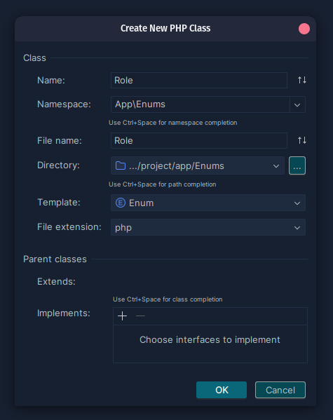
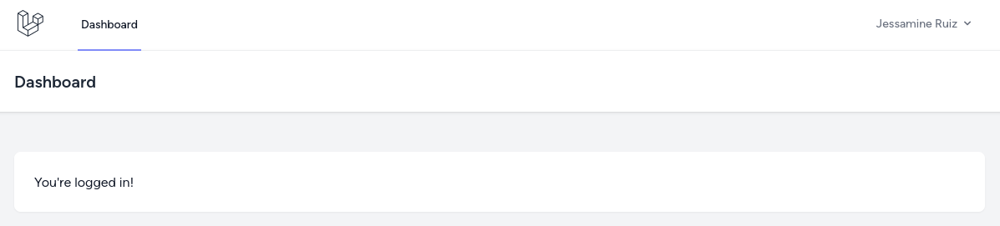
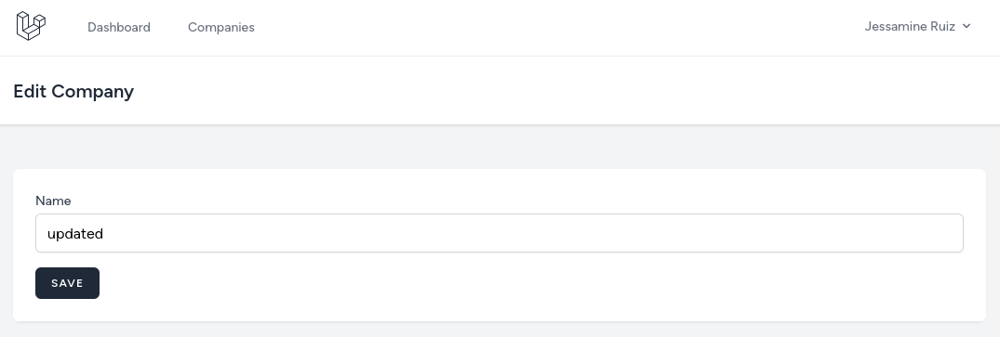

So now that we have some kind of plan, let's start implementing it. We will start by installing [Laravel Breeze](https://laravel.com/docs/starter-kits#breeze-and-blade) starter kit for quick authentication scaffolding and a simple layout. Then, we will create the first CRUD for **companies**.

---

## Install Breeze and Assign Default Role

So first, we will install Breeze.

```sh
composer require laravel/breeze --dev
php artisan breeze:install blade
```

During the planning phase, we already added a `Role` table and a `role_id` column to the `User` table. Because of this, if you try to register you will get an error:

```
SQLSTATE[HY000]: General error: 1364 Field 'role_id' doesn't have a default value
```

So, we need to add the default roles and assign a role when a user registers.

For adding roles, we will create a [Seeder](https://laravel.com/docs/seeding).

```sh
php artisan make:seeder RoleSeeder
```

**database/seeders/RoleSeeder.php**:
```php
use App\Models\Role;

class RoleSeeder extends Seeder
{
    public function run(): void
    {
        Role::create(['name' => 'administrator']);
        Role::create(['name' => 'company owner']);
        Role::create(['name' => 'customer']);
        Role::create(['name' => 'guide']);
    }
}
```

And add this seeder to the `DatabaseSeeder`.

**database/seeders/DatabaseSeeder.php**:
```php
class DatabaseSeeder extends Seeder
{
    public function run(): void
    {
        $this->call([
            RoleSeeder::class,
        ]);
    }
}
```

When the user registers, we need to assign a role. We could just add the ID of the `customer` role in the `RegisteredUserController` of Laravel Breeze. But if sometime in the feature new developer would join this project he wouldn't know what that number means. For this, we will use PHP Enums feature.

There is no command to create enums so we will create it manually. First, create a new directory `App\Enums` and inside it create a PHP file `Role.php`.



Inside `app/Enums/Role.php` we just need to add all the roles and it's value will be the ID.

**app/Enums/Role.php**:
```php
enum Role: int
{
    case ADMINISTRATOR = 1;
    case COMPANY_OWNER = 2;
    case CUSTOMER = 3;
    case GUIDE = 4;
}
```

So now, we can use `Role` Enum where we need it.

**app/Http/Controllers/Auth/RegisteredUserController.php**:
```php
use App\Enums\Role;

class RegisteredUserController extends Controller
{
    public function store(Request $request): RedirectResponse
    {
        // ...

        $user = User::create([
            'name' => $request->name,
            'email' => $request->email,
            'password' => Hash::make($request->password),
            'role_id' => Role::CUSTOMER->value, // [tl! ++]
        ]);

        // ...
    }
}
```

Now we can register, great!



Ok, now we can move to the actual functionality, and looking at the plan... we'll start with managing companies.

---

## Show Table of All Companies

Next, we can create the companies CRUD. For now, it will be available to everyone, and in the next lesson, we will restrict this functionality to administrators only. 

That's in general my approach: first focus on making the feature itself work, and then add more validation and restrictions.

So, first, we need a Controller and a Route.

```sh
php artisan make:controller CompanyController
```

**routes/web.php**:
```php
use App\Http\Controllers\CompanyController;

Route::middleware('auth')->group(function () {
    Route::get('/profile', [ProfileController::class, 'edit'])->name('profile.edit');

    // ...

    Route::resource('companies', CompanyController::class); // [tl! ++]
});
```

And let's add a navigation link in the menu, just next to the dashboard. For that, we will just copy-paste the existing Laravel Breeze `x-nav-link` component.

**resources/views/layouts/navigation.blade.php**:
```blade
// ...
<!-- Navigation Links -->
<div class="hidden space-x-8 sm:-my-px sm:ml-10 sm:flex">
    <x-nav-link :href="route('dashboard')" :active="request()->routeIs('dashboard')">
        {{ __('Dashboard') }}
    </x-nav-link>
    <x-nav-link :href="route('companies.index')" :active="request()->routeIs('companies.index')"> {{-- [tl! ++] --}}
        {{ __('Companies') }} {{-- [tl! ++] --}}
    </x-nav-link> {{-- [tl! ++] --}}
</div>
// ...
```

Next, in the Controller, we need to get all the companies and show them. 

We will save all Blade files related to companies in the `resources/views/companies` directory: it's a common practice to have files like this, often corresponding to the Controller methods:

- `resources/views/[feature-name]/index.blade.php`
- `resources/views/[feature-name]/create.blade.php`
- `resources/views/[feature-name]/edit.blade.php`
- etc.

**app/Http/Controllers/CompanyController.php**
```php
use App\Models\Company;
use Illuminate\View\View;

class CompanyController extends Controller
{
    public function index(): View
    {
        $companies = Company::all();
        
        return view('companies.index', compact('companies'));
    }
}
```

And here's the Blade View file to show all the companies.

**resources/views/companies/index.blade.php**:
```blade
<x-app-layout>
    <x-slot name="header">
        <h2 class="text-xl font-semibold leading-tight text-gray-800">
            {{ __('Companies') }}
        </h2>
    </x-slot>

    <div class="py-12">
        <div class="mx-auto max-w-7xl sm:px-6 lg:px-8">
            <div class="overflow-hidden bg-white shadow-sm sm:rounded-lg">
                <div class="overflow-hidden overflow-x-auto border-b border-gray-200 bg-white p-6">

                    <a href="{{ route('companies.create') }}"
                       class="mb-4 inline-flex items-center rounded-md border border-gray-300 bg-white px-4 py-2 text-xs font-semibold uppercase tracking-widest text-gray-700 shadow-sm transition duration-150 ease-in-out hover:bg-gray-50 focus:outline-none focus:ring-2 focus:ring-indigo-500 focus:ring-offset-2 disabled:opacity-25">
                        Create
                    </a>

                    <div class="min-w-full align-middle">
                        <table class="min-w-full border divide-y divide-gray-200">
                            <thead>
                            <tr>
                                <th class="bg-gray-50 px-6 py-3 text-left">
                                    <span class="text-xs font-medium uppercase leading-4 tracking-wider text-gray-500">Name</span>
                                </th>
                                <th class="w-56 bg-gray-50 px-6 py-3 text-left">
                                </th>
                            </tr>
                            </thead>

                            <tbody class="bg-white divide-y divide-gray-200 divide-solid">
                                @foreach($companies as $company)
                                    <tr class="bg-white">
                                        <td class="px-6 py-4 text-sm leading-5 text-gray-900 whitespace-no-wrap">
                                            {{ $company->name }}
                                        </td>
                                        <td class="px-6 py-4 text-sm leading-5 text-gray-900 whitespace-no-wrap">
                                            <a href="{{ route('companies.edit', $company) }}"
                                               class="inline-flex items-center rounded-md border border-gray-300 bg-white px-4 py-2 text-xs font-semibold uppercase tracking-widest text-gray-700 shadow-sm transition duration-150 ease-in-out hover:bg-gray-50 focus:outline-none focus:ring-2 focus:ring-indigo-500 focus:ring-offset-2 disabled:opacity-25">
                                                Edit
                                            </a>
                                            <form action="{{ route('companies.destroy', $company) }}" method="POST" onsubmit="return confirm('Are you sure?')" style="display: inline-block;">
                                                @csrf
                                                @method('DELETE')
                                                <x-danger-button>
                                                    Delete
                                                </x-danger-button>
                                            </form>
                                        </td>
                                    </tr>
                                @endforeach
                            </tbody>
                        </table>
                    </div>
                </div>
            </div>
        </div>
    </div>
</x-app-layout>
```


---

## Create and Edit Companies

Now that we can show companies, let's add the **create** and **edit** forms. 

For the validation, we will use [Form Requests](https://laravel.com/docs/validation#form-request-validation). So, let's generate them immediately, so we would use them in the Controller.

```sh
php artisan make:request StoreCompanyRequest
php artisan make:request UpdateCompanyRequest
```

Rules in the form request for both save and update are the same.

**app/Http/Requests/StoreCompanyRequest.php**:
```php
class StoreCompanyRequest extends FormRequest
{
    public function authorize(): bool
    {
        return true;
    }

    public function rules(): array
    {
        return [
            'name' => ['required', 'string'],
        ];
    }
}
```

The Controller code for creating and updating:

**app/Http/Controllers/CompanyController.php**:
```php
use Illuminate\Http\RedirectResponse;
use App\Http\Requests\StoreCompanyRequest;
use App\Http\Requests\UpdateCompanyRequest;

class CompanyController extends Controller
{
    // ...

    public function create(): View
    {
        return view('companies.create');
    }

    public function store(StoreCompanyRequest $request): RedirectResponse
    {
        Company::create($request->validated());

        return to_route('companies.index');
    }

    public function edit(Company $company)
    {
        return view('companies.edit', compact('company'));
    }

    public function update(UpdateCompanyRequest $request, Company $company): RedirectResponse
    {
        $company->update($request->validated());

        return to_route('companies.index');
    }
}
```

And here are both create and edit forms.

**resources/views/companies/create.blade.php**:
```blade
<x-app-layout>
    <x-slot name="header">
        <h2 class="text-xl font-semibold leading-tight text-gray-800">
            {{ __('Create Company') }}
        </h2>
    </x-slot>

    <div class="py-12">
        <div class="mx-auto max-w-7xl sm:px-6 lg:px-8">
            <div class="overflow-hidden bg-white shadow-sm sm:rounded-lg">
                <div class="overflow-hidden overflow-x-auto border-b border-gray-200 bg-white p-6">
                    <form action="{{ route('companies.store') }}" method="POST">
                        @csrf

                        <div>
                            <x-input-label for="name" value="Name" />
                            <x-text-input id="name" name="name" value="{{ old('name') }}" type="text" class="block mt-1 w-full" />
                            <x-input-error :messages="$errors->get('name')" class="mt-2" />
                        </div>

                        <div class="mt-4">
                            <x-primary-button>
                                Save
                            </x-primary-button>
                        </div>
                    </form>
                </div>
            </div>
        </div>
    </div>
</x-app-layout>
```

**resources/views/companies/edit.blade.php**:
```blade
<x-app-layout>
    <x-slot name="header">
        <h2 class="text-xl font-semibold leading-tight text-gray-800">
            {{ __('Edit Company') }}
        </h2>
    </x-slot>

    <div class="py-12">
        <div class="mx-auto max-w-7xl sm:px-6 lg:px-8">
            <div class="overflow-hidden bg-white shadow-sm sm:rounded-lg">
                <div class="overflow-hidden overflow-x-auto border-b border-gray-200 bg-white p-6">
                    <form action="{{ route('companies.update', $company) }}" method="POST">
                        @csrf
                        @method('PUT')

                        <div>
                            <x-input-label for="name" value="Name" />
                            <x-text-input id="name" name="name" value="{{ old('name', $company->name) }}" type="text" class="block mt-1 w-full" />
                            <x-input-error :messages="$errors->get('name')" class="mt-2" />
                        </div>

                        <div class="mt-4">
                            <x-primary-button>
                                Save
                            </x-primary-button>
                        </div>
                    </form>
                </div>
            </div>
        </div>
    </div>
</x-app-layout>
```



---

## Delete Companies

Now we just need to implement the **delete** method. Not sure if you noticed, but I've already added the Delete button before, when creating the list page. 

All that's left is to add a method to the Controller.

**app/Http/Controllers/CompanyController.php**:
```php
class CompanyController extends Controller
{
    // ...

    public function destroy(Company $company)
    {
        $company->delete();
        
        return to_route('companies.index');
    }
}
```

That's it! We have fully working companies CRUD. Let's move on to the next lesson.
