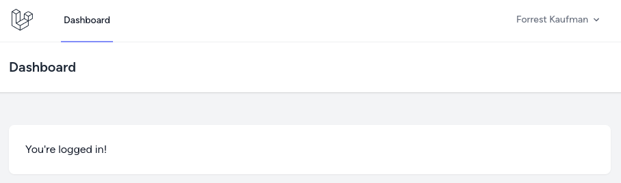

After creating the companies CRUD, the next step is to give access to this CRUD only for users with the `Administrator` role. For this, we will create a [Middleware](https://laravel.com/docs/middleware).

---

## Middleware isAdmin

So, first, we need to create a Middleware and assign a name to it in the Kernel file. We will call it `isAdmin`.

```sh
php artisan make:middleware IsAdminMiddleware
```

**app/Http/Kernel.php**:
```php
class Kernel extends HttpKernel
{
    // ...

    protected $middlewareAliases = [
        'auth' => \App\Http\Middleware\Authenticate::class,

        // ...

        'isAdmin' => \App\Http\Middleware\IsAdminMiddleware::class, // [tl! ++]
    ];
}
```

In the Middleware, we will abort the request if the user doesn't have an `administrator` role.

**App/Http/Middleware/IsAdminMiddleware.php**:
```php
use Symfony\Component\HttpFoundation\Response;

class IsAdminMiddleware
{
    public function handle(Request $request, Closure $next): Response
    {
        abort_if($request->user()->role_id !== 1, Response::HTTP_FORBIDDEN);

        return $next($request);
    }
}
```

**Notice**: I prefer to suffix all filenames in Laravel with their purpose, so `AbcMiddleware` will immediately tell us what that file does. When naming it in the Kernel, you can skip this suffix and shorten it however you want, like `isAdmin` in my case.

Next, we need to add this Middleware to the companies Route.

**routes/web.php**:
```php
Route::middleware('auth')->group(function () {
    // ...

    Route::resource('companies', CompanyController::class); // [tl! --]
    Route::resource('companies', CompanyController::class)->middleware('isAdmin'); // [tl! ++]
});
```

Now, if you visit the companies page as a registered user, you will get a `Forbidden` page, because the default role of users is **customer**, not administrator.


---

## Menu Item: Only For Administrators

Next, we need to hide `Companies` in the navigation menu for everyone except the `administrator` role users. 

We could create a custom [Blade Directive](https://laravel.com/docs/blade#extending-blade), but for now, we will just use a simple `@if` in Blade.

Later, if we see that we are repeating this check, then we will create a dedicated Blade directive. 

**resources/views/layouts/navigation.blade.php**:
```blade
// ...
<!-- Navigation Links -->
<div class="hidden space-x-8 sm:-my-px sm:ml-10 sm:flex">
    <x-nav-link :href="route('dashboard')" :active="request()->routeIs('dashboard')">
        {{ __('Dashboard') }}
    </x-nav-link>
    @if(auth()->user()->role_id === 1) {{-- [tl! add:start] --}}
        <x-nav-link :href="route('companies.index')" :active="request()->routeIs('companies.index')">
            {{ __('Companies') }}
        </x-nav-link>
    @endif {{-- [tl! add:end] --}}
</div>
// ...
```

So now, other users don't see the `Companies` in the navigation.



---

## Automated Tests

My personal philosophy with automated tests is that you need to start writing them almost from the very beginning, feature by feature, immediately after you finish a certain clear part of that feature.

Some people prefer TDD to write tests first, but for me personally it never worked well, cause in many cases you don't have the full clearance on what the feature should look like, in its final version. Which then leads to double work of editing both the code and the tests multiple times.

Other people prefer to write tests after all the project is done, but in that case you may likely forget the details of how certain features work, especially the ones you created long time ago.

Now, let's start with writing tests for permission: to ensure that only users with the `administrator` role can access the `companies` page. 

But first, before that, we need to fix the default tests that come from Laravel Breeze. When we added the `role_id` column to the `Users` table, it broke the default breeze tests:

```
FAILED  Tests\Feature\Auth\AuthenticationTest > users can authenticate using the login screen                                                                   QueryException   
  SQLSTATE[23000]: Integrity constraint violation: 19 NOT NULL constraint failed: users.role_id (Connection: sqlite, SQL: insert into "users" ("name", "email", "email_verified_at", "password", "remember_token", "updated_at", "created_at") values (Dolores Sauer, schmidt.bill@example.com, 2023-05-12 07:33:43, $2y$10$92IXUNpkjO0rOQ5byMi.Ye4oKoEa3Ro9llC/.og/at2.uheWG/igi, 0kYt26ciDo, 2023-05-12 07:33:43, 2023-05-12 07:33:43))

  at vendor/laravel/framework/src/Illuminate/Database/Connection.php:578
    574▕             $this->bindValues($statement, $this->prepareBindings($bindings));
    575▕ 
    576▕             $this->recordsHaveBeenModified();
    577▕ 
  ➜ 578▕             return $statement->execute();
    579▕         });
    580▕     }
    581▕ 
    582▕     /**

      +15 vendor frames 
  16  tests/Feature/Auth/AuthenticationTest.php:23
```

To fix it, we just need to add the `role_id` to the `UserFactory`. And while we are at the `UserFactory` let's add a [Factory State](https://laravel.com/docs/eloquent-factories#factory-states) for easier creation of an `administrator` user.

**database/factories/UserFactory.php**:
```php
class UserFactory extends Factory
{
    public function definition(): array
    {
        return [
            'name' => fake()->name(),
            'email' => fake()->unique()->safeEmail(),
            'email_verified_at' => now(),
            'password' => '$2y$10$92IXUNpkjO0rOQ5byMi.Ye4oKoEa3Ro9llC/.og/at2.uheWG/igi', // password
            'remember_token' => Str::random(10),
            'role_id' => 3, // [tl! ++]
        ];
    }
    // ...
    public function admin(): static // [tl! add:start]
    {
        return $this->state(fn (array $attributes) => [
            'role_id' => 1,
        ]);
    } // [tl! add:end]
}
```

Now the tests passes.

```
Tests:    24 passed (56 assertions)
Duration: 1.07s
```

So now, we can create our tests.

```sh
php artisan make:test CompanyTest
```

This file of `CompanyTest` will contain all the methods related to managing companies.

**tests/Feature/CompanyTest.php**:
```php
use App\Models\User;
use Illuminate\Foundation\Testing\RefreshDatabase;
use Tests\TestCase;

class CompanyTest extends TestCase
{
    use RefreshDatabase;

    public function test_admin_user_can_access_companies_index_page(): void
    {
        $user = User::factory()->admin()->create();

        $response = $this->actingAs($user)->get(route('companies.index'));

        $response->assertOk();
    }

    public function test_non_admin_user_cannot_access_companies_index_page(): void
    {
        $user = User::factory()->create();

        $response = $this->actingAs($user)->get(route('companies.index'));

        $response->assertForbidden();
    }
}
```

So, what do we do in these tests?

- First, because in the tests we are working with the database, we enable the `RefreshDatabase` trait. But don't forget to edit your `phpunit.xml` to ensure you're working on the **testing** database and not live!
- Next, we create a user. Here, in the first test, we use the earlier added `admin()` state from the Factory.
- Then, acting as a newly-created user, we go to the `companies.index` route.
- Ant last, we check the response. The administrator will get a response HTTP status of `200 OK` and other users will receive an HTTP status of `403 Forbidden`.

```
> php artisan test --filter=CompanyTest

PASS  Tests\Feature\CompanyTest
✓ admin user can access companies index page                                                                                                                               0.09s  
✓ non admin user cannot access companies index page                                                                                                                        0.01s  

Tests:    2 passed (2 assertions)
Duration: 0.13s
```
