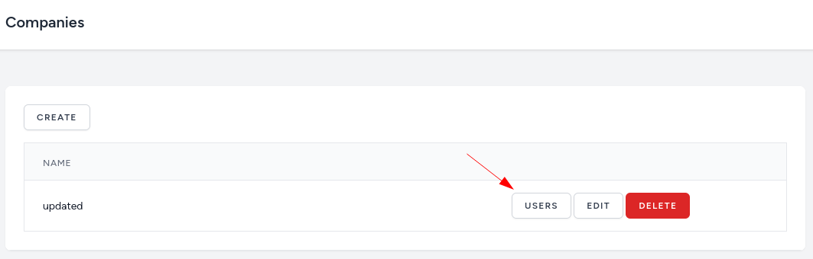
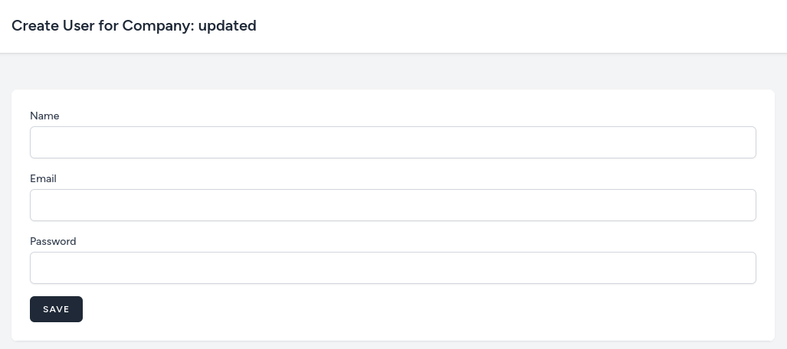
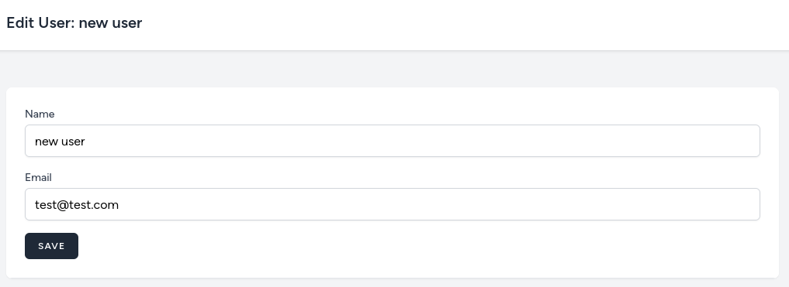

Before implementing the next feature, adding users to the company, we asked the client a few questions.

**Q**: Can a company have more than one user?
**A**: Yes.

**Q**: Who can manage users for the company? Only the `administrator` or the company itself.
**A**: The company itself.

**Q**: Can one user be in more than one company?
**A**: No.

From these answers, we know that in the planning part adding `company_id` to the `User` table for assigning a user to the company is enough. But, the client said that the company itself will be able to manage users which wasn't mentioned before. Because of this, **we need to tell** the client that it will take longer to implement this feature and that it will cost more.

Ideally, these questions would have been asked before even starting to code to avoid such misunderstandings.

---

## Nested Resource Controller

First, we will implement a feature for the users with the `administrator` role. For it, we will use the [Nested Resources](https://laravel.com/docs/controllers#restful-nested-resources) feature.

So, first, let's create a Controller and a Route.

```sh
php artisan make:controller CompanyUserController
```

**routes/web.php**:
```php
use App\Http\Controllers\CompanyUserController;

Route::middleware('auth')->group(function () {
    // ...

    Route::resource('companies', CompanyController::class)->middleware('isAdmin');
    Route::resource('companies.users', CompanyUserController::class)->except('show'); //[tl! ++]
});
```

> I specifically didn't add `isAdmin` middleware for this route because it can be reused for users with the `company owner` role. We will only need to restrict access so that users couldn't see other companies. My first thought for this is to use [Policies](https://laravel.com/docs/authorization).

So now we can add a new action to the companies list page.

**resources/views/companies/index.blade.php**:
```blade
// ...

    <td class="px-6 py-4 text-sm leading-5 text-gray-900 whitespace-no-wrap">
        <a href="{{ route('companies.users.index', $company) }}" {{-- [tl! add:start] --}}
           class="inline-flex items-center rounded-md border border-gray-300 bg-white px-4 py-2 text-xs font-semibold uppercase tracking-widest text-gray-700 shadow-sm transition duration-150 ease-in-out hover:bg-gray-50 focus:outline-none focus:ring-2 focus:ring-indigo-500 focus:ring-offset-2 disabled:opacity-25">
            Users
        </a> {{-- [tl! add:end] --}}
        <a href="{{ route('companies.edit', $company) }}"
           class="inline-flex items-center rounded-md border border-gray-300 bg-white px-4 py-2 text-xs font-semibold uppercase tracking-widest text-gray-700 shadow-sm transition duration-150 ease-in-out hover:bg-gray-50 focus:outline-none focus:ring-2 focus:ring-indigo-500 focus:ring-offset-2 disabled:opacity-25">
            Edit
        </a>
        <form action="{{ route('companies.destroy', $company) }}" method="POST" onsubmit="return confirm('Are you sure?')" style="display: inline-block;">
            @csrf
            @method('DELETE')
            <x-danger-button>
                Delete
            </x-danger-button>
        </form>
    </td>
    
// ...
```



Next, in the Controller we need all the users that belong to the company. But first, we need a `users` relation in the `Company` Model.

**app/Models/Company.php**:
```php
use Illuminate\Database\Eloquent\Relations\HasMany;

class Company extends Model
{
    // ...

    public function users(): HasMany
    {
        return $this->hasMany(User::class);
    }
}
```

Similar to how we saved all Blade files for the companies in the `resources/views/companies` directory, it's very logical to create a new directory inside it called `users`. This way when someone would check the `resources/views/companies` directory he would know that `users` belong to companies.

So, the directory structure for nested resources would be like this:
- `resources/views/[parent]/[child]/index.blade.php`
- `resources/views/[parent]/[child]/create.blade.php`
- `resources/views/[parent]/[child]/edit.blade.php`
- etc.

**app/Http/Controllers/CompanyUserController.php**:
```php
use App\Models\Company;

class CompanyUserController extends Controller
{
    public function index(Company $company)
    {
        $users = $company->users()->get();

        return view('companies.users.index', compact('company', 'users'));
    }
}
```

And here's the Blade View file to show all the users that belong to the selected company.

```blade
<x-app-layout>
    <x-slot name="header">
        <h2 class="text-xl font-semibold leading-tight text-gray-800">
            {{ __('Company users') }}
        </h2>
    </x-slot>

    <div class="py-12">
        <div class="mx-auto max-w-7xl sm:px-6 lg:px-8">
            <div class="overflow-hidden bg-white shadow-sm sm:rounded-lg">
                <div class="overflow-hidden overflow-x-auto border-b border-gray-200 bg-white p-6">

                    <a href="{{ route('companies.users.create', $company) }}"
                       class="mb-4 inline-flex items-center rounded-md border border-gray-300 bg-white px-4 py-2 text-xs font-semibold uppercase tracking-widest text-gray-700 shadow-sm transition duration-150 ease-in-out hover:bg-gray-50 focus:outline-none focus:ring-2 focus:ring-indigo-500 focus:ring-offset-2 disabled:opacity-25">
                        Create
                    </a>

                    <div class="min-w-full align-middle">
                        <table class="min-w-full border divide-y divide-gray-200">
                            <thead>
                            <tr>
                                <th class="bg-gray-50 px-6 py-3 text-left">
                                    <span class="text-xs font-medium uppercase leading-4 tracking-wider text-gray-500">Name</span>
                                </th>
                                <th class="w-56 bg-gray-50 px-6 py-3 text-left">
                                </th>
                            </tr>
                            </thead>

                            <tbody class="bg-white divide-y divide-gray-200 divide-solid">
                                @foreach($users as $user)
                                    <tr class="bg-white">
                                        <td class="px-6 py-4 text-sm leading-5 text-gray-900 whitespace-no-wrap">
                                            {{ $user->name }}
                                        </td>
                                        <td class="px-6 py-4 text-sm leading-5 text-gray-900 whitespace-no-wrap">
                                            <a href="{{ route('companies.users.edit', [$company, $user]) }}"
                                               class="inline-flex items-center rounded-md border border-gray-300 bg-white px-4 py-2 text-xs font-semibold uppercase tracking-widest text-gray-700 shadow-sm transition duration-150 ease-in-out hover:bg-gray-50 focus:outline-none focus:ring-2 focus:ring-indigo-500 focus:ring-offset-2 disabled:opacity-25">
                                                Edit
                                            </a>
                                            <form action="{{ route('companies.users.destroy', [$company, $user]) }}" method="POST" onsubmit="return confirm('Are you sure?')" style="display: inline-block;">
                                                @csrf
                                                @method('DELETE')
                                                <x-danger-button>
                                                    Delete
                                                </x-danger-button>
                                            </form>
                                        </td>
                                    </tr>
                                @endforeach
                            </tbody>
                        </table>
                    </div>
                </div>
            </div>
        </div>
    </div>
</x-app-layout>
```

This blade file is very similar to the one we had for listing the companies. The main difference is that because this is a nested view for every action we also need to pass a company.

---

## Create and Edit Users for the Company

Now that we can show users for a specific company, let's add the **create** and **edit** forms.

For the validation, we will use [Form Requests](https://laravel.com/docs/validation#form-request-validation). So, let's generate them immediately, so we would use them in the Controller.

```sh
php artisan make:request StoreUserRequest
php artisan make:request UpdateUserRequest
```

**app/Http/Requests/StoreUserRequest.php**:
```php
use App\Models\User;
use Illuminate\Validation\Rules;

class StoreUserRequest extends FormRequest
{
    public function authorize(): bool
    {
        return true;
    }

    public function rules(): array
    {
        return [
            'name' => ['required', 'string'],
            'email' => ['required', 'email', 'unique:users,email'],
            'password' => ['required', Rules\Password::defaults()],
        ];
    }
}
```

**app/Http/Requests/UpdateUserRequest.php**:
```php
class UpdateUserRequest extends FormRequest
{
    public function authorize(): bool
    {
        return true;
    }

    public function rules(): array
    {
        return [
            'name' => ['required', 'string'],
            'email' => ['required', 'email', 'unique:users,email,' . $this->user->id],
        ];
    }
}
```

The Controller code for creating and updating:

**app/Http/Controllers/CompanyUserController.php**:
```php
use App\Enums\Role;
use App\Models\User;
use App\Http\Requests\StoreUserRequest;
use App\Http\Requests\UpdateUserRequest;

class CompanyUserController extends Controller
{
    // ...

    public function create(Company $company)
    {
        return view('companies.users.create', compact('company'));
    }

    public function store(StoreUserRequest $request, Company $company)
    {
        $company->users()->create([
            'name' => $request->input('name'),
            'email' => $request->input('email'),
            'password' => bcrypt($request->input('password')),
            'role_id' => Role::CUSTOMER->value,
        ]);

        return to_route('companies.users.index', $company);
    }

    public function edit(Company $company, User $user)
    {
        return view('companies.users.edit', compact('company', 'user'));
    }

    public function update(UpdateUserRequest $request, Company $company, User $user)
    {
        $user->update($request->validated());

        return to_route('companies.users.index', $company);
    }
}
```

And here are both create and edit forms.

**resources/views/companies/users/create.blade.php**:
```blade
<x-app-layout>
    <x-slot name="header">
        <h2 class="text-xl font-semibold leading-tight text-gray-800">
            {{ __('Create User for Company') }}: {{ $company->name }}
        </h2>
    </x-slot>

    <div class="py-12">
        <div class="mx-auto max-w-7xl sm:px-6 lg:px-8">
            <div class="overflow-hidden bg-white shadow-sm sm:rounded-lg">
                <div class="overflow-hidden overflow-x-auto border-b border-gray-200 bg-white p-6">
                    <form action="{{ route('companies.users.store', $company) }}" method="POST">
                        @csrf

                        <div>
                            <x-input-label for="name" value="Name" />
                            <x-text-input id="name" name="name" value="{{ old('name') }}" type="text" class="block mt-1 w-full" />
                            <x-input-error :messages="$errors->get('name')" class="mt-2" />
                        </div>

                        <div class="mt-4">
                            <x-input-label for="email" value="Email" />
                            <x-text-input id="email" name="email" value="{{ old('email') }}" type="text" class="block mt-1 w-full" />
                            <x-input-error :messages="$errors->get('email')" class="mt-2" />
                        </div>

                        <div class="mt-4">
                            <x-input-label for="password" value="Password" />
                            <x-text-input id="password" name="password" value="{{ old('password') }}" type="password" class="block mt-1 w-full" />
                            <x-input-error :messages="$errors->get('password')" class="mt-2" />
                        </div>

                        <div class="mt-4">
                            <x-primary-button>
                                Save
                            </x-primary-button>
                        </div>
                    </form>
                </div>
            </div>
        </div>
    </div>
</x-app-layout>
```



**resources/views/companies/users/edit.blade.php**:
```blade
<x-app-layout>
    <x-slot name="header">
        <h2 class="text-xl font-semibold leading-tight text-gray-800">
            {{ __('Edit User') }}: {{ $user->name }}
        </h2>
    </x-slot>

    <div class="py-12">
        <div class="mx-auto max-w-7xl sm:px-6 lg:px-8">
            <div class="overflow-hidden bg-white shadow-sm sm:rounded-lg">
                <div class="overflow-hidden overflow-x-auto border-b border-gray-200 bg-white p-6">
                    <form action="{{ route('companies.users.update', [$company, $user]) }}" method="POST">
                        @csrf
                        @method('PUT')

                        <div>
                            <x-input-label for="name" value="Name" />
                            <x-text-input id="name" name="name" value="{{ old('name', $user->name) }}" type="text" class="block mt-1 w-full" />
                            <x-input-error :messages="$errors->get('name')" class="mt-2" />
                        </div>

                        <div class="mt-4">
                            <x-input-label for="email" value="Email" />
                            <x-text-input id="email" name="email" value="{{ old('email', $user->email) }}" type="text" class="block mt-1 w-full" />
                            <x-input-error :messages="$errors->get('email')" class="mt-2" />
                        </div>

                        <div class="mt-4">
                            <x-primary-button>
                                Save
                            </x-primary-button>
                        </div>
                    </form>
                </div>
            </div>
        </div>
    </div>
</x-app-layout>
```



---

## Delete User

When creating the list page we already added the Delete button. All that's left is to add a method to the Controller.

**app/Http/Controllers/CompanyUserController.php**:
```php
class CompanyUserController extends Controller
{
    // ...

    public function destroy(Company $company, User $user)
    {
        $user->delete();

        return to_route('companies.users.index', $company);
    }
}
```

---

## Tests

Now let's add tests. In the next lesson, we will allow users with the `company owner` role to also see these pages. By adding tests now for the administrator users we will know that the new feature didn't break anything for the `administrator` role.

First, we need to create a [Factory](https://laravel.com/docs/eloquent-factories) for the `Company` Model.

```sh
php artisan make:factory CompanyFactory
```

**app/database/factories/CompanyFactory.php**:
```php
class CompanyFactory extends Factory
{
    public function definition(): array
    {
        return [
            'name' => fake()->words(3),
        ];
    }
}
```

Now the test.

```sh
php artisan make:test CompanyUserTest
```

And in this test, we will test that user with the `administrator` role can do every CRUD action.

**tests/Feature/CompanyUserTest.php**:
```php
use App\Models\User;
use App\Models\Company;
use Illuminate\Foundation\Testing\RefreshDatabase;
use Tests\TestCase;

class CompanyUserTest extends TestCase
{
    use RefreshDatabase;

    public function test_admin_can_access_company_users_page()
    {
        $company = Company::factory()->create();
        $user = User::factory()->admin()->create();

        $response = $this->actingAs($user)->get(route('companies.users.index', $company->id));

        $response->assertOk();
    }

    public function test_admin_can_create_user_for_a_company()
    {
        $company = Company::factory()->create();
        $user = User::factory()->admin()->create();

        $response = $this->actingAs($user)->post(route('companies.users.store', $company->id), [
            'name' => 'test user',
            'email' => 'test@test.com',
            'password' => 'password',
        ]);

        $response->assertRedirect(route('companies.users.index', $company->id));

        $this->assertDatabaseHas('users', [
            'name' => 'test user',
            'email' => 'test@test.com',
        ]);
    }

    public function test_admin_can_edit_user_for_a_company()
    {
        $company = Company::factory()->create();
        $user = User::factory()->admin()->create(['company_id' => $company->id]);

        $response = $this->actingAs($user)->put(route('companies.users.update', [$company->id, $user->id]), [
            'name' => 'updated user',
            'email' => 'test@update.com',
        ]);

        $response->assertRedirect(route('companies.users.index', $company->id));

        $this->assertDatabaseHas('users', [
            'name' => 'updated user',
            'email' => 'test@update.com',
        ]);
    }

    public function test_admin_can_delete_user_for_a_company()
    {
        $company = Company::factory()->create();
        $user = User::factory()->admin()->create(['company_id' => $company->id]);

        $response = $this->actingAs($user)->delete(route('companies.users.update', [$company->id, $user->id]));

        $response->assertRedirect(route('companies.users.index', $company->id));

        $this->assertDatabaseMissing('users', [
            'name' => 'updated user',
            'email' => 'test@update.com',
        ]);
    }
}
```

```
> php artisan test --filter=CompanyUserTest                                                                                                      

PASS  Tests\Feature\CompanyUserTest
✓ admin can access company users page 0.09s  
✓ admin can create user for a company 0.02s  
✓ admin can edit user for a company 0.01s  
✓ admin can delete user for a company 0.01s  

Tests:    4 passed (10 assertions)
Duration: 0.16s
```
