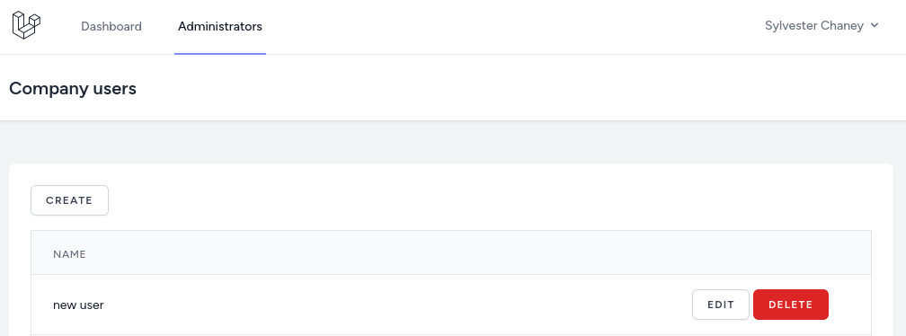

Now that administrator can add users to the company, next we need to implement a feature where the company owner can add users to its company himself.

---

## Soft Delete Users

First, let's add [`SoftDeletes`](https://laravel.com/docs/eloquent#soft-deleting) for the User Model in case someone accidentally will delete a user.

```sh
php artisan make:migration "add soft deletes to users table"
```

**database/migrations/xxxx_add_soft_deletes_to_users_table.php**:
```php
public function up(): void
{
    Schema::table('users', function (Blueprint $table) {
        $table->softDeletes();
    });
}
```

**app/Models/User.php**:
```php
use Illuminate\Database\Eloquent\SoftDeletes;

class User extends Authenticatable
{
    use HasApiTokens, HasFactory, Notifiable;
    use SoftDeletes; // [tl! ++]

    // ...
}
```

Because of this added feature, the test `test_user_can_delete_their_account` that came from Laravel Breeze now is broken.

**tests/Feature/ProfileTest**:
```php
class ProfileTest extends TestCase
{
// ...

    public function test_user_can_delete_their_account(): void
    {
        $user = User::factory()->create();

        $response = $this
            ->actingAs($user)
            ->delete('/profile', [
                'password' => 'password',
            ]);

        $response
            ->assertSessionHasNoErrors()
            ->assertRedirect('/');

        $this->assertGuest();
        $this->assertNull($user->fresh()); // [tl! --]
        $this->assertSoftDeleted($user->fresh()); // [tl! ++]
    }
    
// ...
}
```

Great, now it's fixed!

```
> php artisan test --filter=test_user_can_delete_their_account

PASS  Tests\Feature\ProfileTest
✓ user can delete their account 0.13s  

Tests:    1 passed (5 assertions)
Duration: 0.15s
```

---

## CRUD Actions

Now, let's move on to the main feature. First, let's show in the navigation the new item `Administrators` which will be visible only for users with the role of `Company Owner`. Again, for now, I will just add a simple `@if` to check for the `role_id`. Let's add this new menu item under the companies.

**resources/views/layouts/navigation.blade.php**:
```blade
// ...
<!-- Navigation Links -->
<div class="hidden space-x-8 sm:-my-px sm:ml-10 sm:flex">
    <x-nav-link :href="route('dashboard')" :active="request()->routeIs('dashboard')">
        {{ __('Dashboard') }}
    </x-nav-link>
    @if(auth()->user()->role_id === \App\Enums\Role::ADMINISTRATOR->value)
        <x-nav-link :href="route('companies.index')" :active="request()->routeIs('companies.index')">
            {{ __('Companies') }}
        </x-nav-link>
    @endif
    @if(auth()->user()->role_id === \App\Enums\Role::COMPANY_OWNER->value) {{-- [tl! add:start] --}}
        <x-nav-link :href="route('companies.users.index', auth()->user()->company_id)" :active="request()->routeIs('companies.users.*')">
            {{ __('Administrators') }}
        </x-nav-link>
    @endif {{-- [tl! add:end] --}}
</div>
// ...
```




Now that we have the navigation link, let's implement the backend part. So, first, let's create a policy and register it in the `AuthServiceProvider`.

```sh
php artisan make:policy CompanyUserPolicy --model=Company
```

**app/Providers/AuthServiceProvider.php**:
```php
use App\Models\Company;
use App\Policies\CompanyUserPolicy;

class AuthServiceProvider extends ServiceProvider
{
    protected $policies = [
        Company::class => CompanyUserPolicy::class,
    ];

    // ...
}
```

In the policy itself, I immediately thought that an `administrator` will be able to do everything. So for this, I immediately remembered the `before` [Policy Filter](https://laravel.com/docs/authorization#authorizing-actions-using-policies) method. In this method, we will just return true if the user has the role of `administrator`.

For other CRUD methods, I thought about what check needs to be done. And it's very simple, we just need to check that role is the `Company Owner`, and that the users' company is the company in which he tries to do the action.

So, the whole policy code is below.

**app/Policies/CompanyUserPolicy.php**:
```php
use App\Enums\Role;
use App\Models\User;
use App\Models\Company;

class CompanyUserPolicy
{
    public function before(User $user): bool|null
    {
        if ($user->role_id === Role::ADMINISTRATOR->value) {
            return true;
        }

        return null;
    }

    public function viewAny(User $user, Company $company): bool
    {
        return $user->role_id === Role::COMPANY_OWNER->value && $user->company_id === $company->id;
    }

    public function create(User $user, Company $company): bool
    {
        return $user->role_id === Role::COMPANY_OWNER->value && $user->company_id === $company->id;
    }

    public function update(User $user, Company $company): bool
    {
        return $user->role_id === Role::COMPANY_OWNER->value && $user->company_id === $company->id;
    }

    public function delete(User $user, Company $company): bool
    {
        return $user->role_id === Role::COMPANY_OWNER->value && $user->company_id === $company->id;
    }
}
```

Next, in the `CompanyUserController` we need to do the `authorize` check for each CRUD action. There are a couple of ways to do that but I will use the [`authorize`](https://laravel.com/docs/authorization#via-controller-helpers) method.

> For other authorizing ways check the [official documentation](https://laravel.com/docs/authorization#authorizing-actions-using-policies).

**app/Http/Controllers/CompanyUserController.php**:
```php
class CompanyUserController extends Controller
{
    public function index(Company $company)
    {
        $this->authorize('viewAny', $company); // [tl! ++]

        // ...
    }

    public function create(Company $company)
    {
        $this->authorize('create', $company);

        // ...
    }

    public function store(StoreUserRequest $request, Company $company)
    {
        $this->authorize('create', $company); // [tl! ++]

        // ...
    }

    public function edit(Company $company, User $user)
    {
        $this->authorize('update', $company); // [tl! ++]

        // ...
    }

    public function update(UpdateUserRequest $request, Company $company, User $user)
    {
        $this->authorize('update', $company); // [tl! ++]

        // ...
    }

    public function destroy(Company $company, User $user)
    {
        $this->authorize('delete', $company); // [tl! ++]

        // ...
    }
}
```

Great! Now users with the role of `Company Owner` can create new users for their company and cannot do any CRUD actions for other companies.

---

## Tests

So now we made some changes to the `CompanyUserController` and added additional authorization. First, let's check if we didn't break anything for the users with the `administrator` role.

```
> php artisan test --filter=CompanyUserTest                                                                                                      

PASS  Tests\Feature\CompanyUserTest
✓ admin can access company users page 0.09s  
✓ admin can create user for a company 0.02s  
✓ admin can edit user for a company 0.01s  
✓ admin can delete user for a company 0.01s  

Tests:    4 passed (10 assertions)
Duration: 0.16s
```

Great! All tests are green.

Now let's add more tests to the `CompanyUserTest`. We will check if the user with the `Company Owner` role can do CRUD actions for his company and cannot do any for other companies.

Before adding the tests, we need to add another [Factory State](https://laravel.com/docs/eloquent-factories#factory-states) for the `Company Owner` role.

**database/factories/UserFactory.php**:
```php
class UserFactory extends Factory
{
    // ...

    public function companyOwner(): static
    {
        return $this->state(fn (array $attributes) => [
            'role_id' => Role::COMPANY_OWNER->value,
        ]);
    }
}
```

And the tests themself.

**tests/Feature/CompanyUserTest.php**:
```php
class CompanyUserTest extends TestCase
{
    // ...

    public function test_company_owner_can_view_his_companies_users()
    {
        $company = Company::factory()->create();
        $user = User::factory()->companyOwner()->create(['company_id' => $company->id]);
        $secondUser = User::factory()->companyOwner()->create(['company_id' => $company->id]);

        $response = $this->actingAs($user)->get(route('companies.users.index', $company->id));

        $response->assertOk()
            ->assertSeeText($secondUser->name);
    }

    public function test_company_owner_cannot_view_other_companies_users()
    {
        $company = Company::factory()->create();
        $company2 = Company::factory()->create();
        $user = User::factory()->companyOwner()->create(['company_id' => $company->id]);

        $response = $this->actingAs($user)->get(route('companies.users.index', $company2->id));

        $response->assertForbidden();
    }

    public function test_company_owner_can_create_user_to_his_company()
    {
        $company = Company::factory()->create();
        $user = User::factory()->companyOwner()->create(['company_id' => $company->id]);

        $response = $this->actingAs($user)->post(route('companies.users.store', $company->id), [
            'name' => 'test user',
            'email' => 'test@test.com',
            'password' => 'password',
        ]);

        $response->assertRedirect(route('companies.users.index', $company->id));

        $this->assertDatabaseHas('users', [
            'name' => 'test user',
            'email' => 'test@test.com',
            'company_id' => $company->id,
        ]);
    }

    public function test_company_owner_cannot_create_user_to_other_company()
    {
        $company = Company::factory()->create();
        $company2 = Company::factory()->create();
        $user = User::factory()->companyOwner()->create(['company_id' => $company->id]);

        $response = $this->actingAs($user)->post(route('companies.users.store', $company2->id), [
            'name' => 'test user',
            'email' => 'test@test.com',
            'password' => 'password',
        ]);

        $response->assertForbidden();
    }

    public function test_company_owner_can_edit_user_for_his_company()
    {
        $company = Company::factory()->create();
        $user = User::factory()->companyOwner()->create(['company_id' => $company->id]);

        $response = $this->actingAs($user)->put(route('companies.users.update', [$company->id, $user->id]), [
            'name' => 'updated user',
            'email' => 'test@update.com',
        ]);

        $response->assertRedirect(route('companies.users.index', $company->id));

        $this->assertDatabaseHas('users', [
            'name' => 'updated user',
            'email' => 'test@update.com',
            'company_id' => $company->id,
        ]);
    }

    public function test_company_owner_cannot_edit_user_for_other_company()
    {
        $company = Company::factory()->create();
        $company2 = Company::factory()->create();
        $user = User::factory()->companyOwner()->create(['company_id' => $company->id]);

        $response = $this->actingAs($user)->put(route('companies.users.update', [$company2->id, $user->id]), [
            'name' => 'updated user',
            'email' => 'test@update.com',
        ]);

        $response->assertForbidden();
    }

    public function test_company_owner_can_delete_user_for_his_company()
    {
        $company = Company::factory()->create();
        $user = User::factory()->companyOwner()->create(['company_id' => $company->id]);

        $response = $this->actingAs($user)->delete(route('companies.users.update', [$company->id, $user->id]));

        $response->assertRedirect(route('companies.users.index', $company->id));

        $this->assertDatabaseMissing('users', [
            'name' => 'updated user',
            'email' => 'test@update.com',
        ]);
    }

    public function test_company_owner_cannot_delete_user_for_other_company()
    {
        $company = Company::factory()->create();
        $company2 = Company::factory()->create();
        $user = User::factory()->companyOwner()->create(['company_id' => $company->id]);

        $response = $this->actingAs($user)->delete(route('companies.users.update', [$company2->id, $user->id]));

        $response->assertForbidden();
    }
}
```

```
> php artisan test --filter=CompanyUserTest

PASS  Tests\Feature\CompanyUserTest
✓ admin can access company users page 0.09s  
✓ admin can create user for a company 0.02s  
✓ admin can edit user for a company 0.01s  
✓ admin can delete user for a company 0.01s  
✓ company owner can view his companies users 0.02s  
✓ company owner cannot view other companies users 0.01s  
✓ company owner can create user to his company 0.01s  
✓ company owner cannot create user to other company 0.02s  
✓ company owner can edit user for his company 0.01s  
✓ company owner cannot edit user for other company 0.01s  
✓ company owner can delete user for his company 0.01s  
✓ company owner cannot delete user for other company 0.01s  

Tests:    12 passed (25 assertions)
Duration: 0.28s
```

Good. All the tests passed!