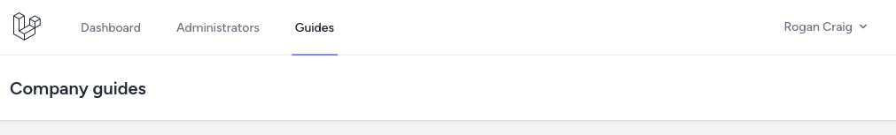
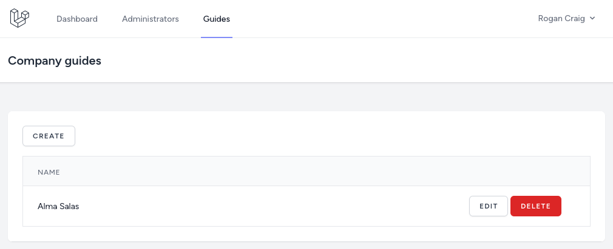

Before implementing the creation of the users with the role of `Guide`, we asked the client some questions again.

**Question**: Who will be able to manage guides? Only company owners?
**Answer**: Yes, only company owners will manage guides for their company.
**What it means to us**: No additional changes to the structure are needed.

From this answer, we now know that a lot of code made within the previous CRUD for `Company Owner` can be reused.

---

## Guides CRUD actions

So, as always, we need a Controller and to add Routes. Again this Controller will be a [Nested Resource](https://laravel.com/docs/controllers#restful-nested-resources).

```sh
php artisan make:controller CompanyGuideController
```

**routes/web.php**
```php
use App\Http\Controllers\CompanyGuideController;

Route::middleware('auth')->group(function () {
    // ...
    
    Route::resource('companies.users', CompanyUserController::class)->except('show');
    Route::resource('companies.guides', CompanyGuideController::class)->except('show'); // [tl! ++]
});
```

For the navigation, because this link will only need to see the user with the `Company Owner` role, we will add it below the `Administrators` link in the same `if` statement.

**resources/views/layouts/navigation.blade.php**:
```blade
// ...
<!-- Navigation Links -->
<div class="hidden space-x-8 sm:-my-px sm:ml-10 sm:flex">
    <x-nav-link :href="route('dashboard')" :active="request()->routeIs('dashboard')">
        {{ __('Dashboard') }}
    </x-nav-link>
    @if(auth()->user()->role_id === \App\Enums\Role::ADMINISTRATOR->value)
        <x-nav-link :href="route('companies.index')" :active="request()->routeIs('companies.index')">
            {{ __('Companies') }}
        </x-nav-link>
    @endif
    @if(auth()->user()->role_id === \App\Enums\Role::COMPANY_OWNER->value)
        <x-nav-link :href="route('companies.users.index', auth()->user()->company_id)" :active="request()->routeIs('companies.users.*')">
            {{ __('Administrators') }}
        </x-nav-link>
        <x-nav-link :href="route('companies.guides.index', auth()->user()->company_id)" :active="request()->routeIs('companies.guides.*')"> {{-- [tl! add:start] --}}
            {{ __('Guides') }}
        </x-nav-link> {{-- [tl! add:end] --}}
    @endif
</div>
// ...
```



For the validation, we will again use the [Form Requests](https://laravel.com/docs/validation#form-request-validation).

```sh
php artisan make:request StoreGuideRequest
php artisan make:request UpdateGuideRequest
```

**app/Http/Requests/StoreGuideRequest.php**:
```php
class StoreGuideRequest extends FormRequest
{
    public function authorize(): bool
    {
        return true;
    }

    public function rules(): array
    {
        return [
            'name' => ['required', 'string'],
            'email' => ['required', 'email', 'unique:users,email'],
            'password' => ['required', Rules\Password::defaults()],
        ];
    }
}
```

**app/Http/Requests/UpdateGuideRequest.php**:
```php
class UpdateGuideRequest extends FormRequest
{
    public function authorize(): bool
    {
        return true;
    }

    public function rules(): array
    {
        return [
            'name' => ['required', 'string'],
            'email' => ['required', 'email', 'unique:users,email,' . $this->guide->id],
        ];
    }
}
```

The Controller is almost identical to the `CompanyUserController`. We can even reuse the same Policy for the permissions. We must change everything from `users` to `guides`.

**app/Http/Controllers/CompanyGuideController.php**:
```php
use App\Enums\Role;
use App\Models\User;
use App\Models\Company;
use App\Http\Requests\StoreGuideRequest;
use App\Http\Requests\UpdateGuideRequest;

class CompanyGuideController extends Controller
{
    public function index(Company $company)
    {
        $this->authorize('viewAny', $company);

        $guides = $company->users()->where('role_id', Role::COMPANY_OWNER->value)->get();

        return view('companies.guides.index', compact('company', 'guides'));
    }

    public function create(Company $company)
    {
        $this->authorize('create', $company);

        return view('companies.guides.create', compact('company'));
    }

    public function store(StoreGuideRequest $request, Company $company)
    {
        $this->authorize('create', $company);

        $company->users()->create([
            'name' => $request->input('name'),
            'email' => $request->input('email'),
            'password' => bcrypt($request->input('password')),
            'role_id' => Role::GUIDE->value,
        ]);

        return to_route('companies.guides.index', $company);
    }

    public function edit(Company $company, User $guide)
    {
        $this->authorize('update', $company);

        return view('companies.guides.edit', compact('company', 'guide'));
    }

    public function update(UpdateGuideRequest $request, Company $company, User $guide)
    {
        $this->authorize('update', $company);

        $guide->update($request->validated());

        return to_route('companies.guides.index', $company);
    }

    public function destroy(Company $company, User $guide)
    {
        $this->authorize('delete', $company);

        $guide->delete();

        return to_route('companies.guides.index', $company);
    }
}
```

For the views, because this is again a Nested Controller and belongs to a Company, all blade files will be saved in the `resources/views/companies/guides` directory. Here are the Blade files for listing, creating, and editing guides.

**resources/views/companies/guides/index.blade.php**:
```blade
<x-app-layout>
    <x-slot name="header">
        <h2 class="text-xl font-semibold leading-tight text-gray-800">
            {{ __('Company guides') }}
        </h2>
    </x-slot>

    <div class="py-12">
        <div class="mx-auto max-w-7xl sm:px-6 lg:px-8">
            <div class="overflow-hidden bg-white shadow-sm sm:rounded-lg">
                <div class="overflow-hidden overflow-x-auto border-b border-gray-200 bg-white p-6">

                    <a href="{{ route('companies.guides.create', $company) }}"
                       class="mb-4 inline-flex items-center rounded-md border border-gray-300 bg-white px-4 py-2 text-xs font-semibold uppercase tracking-widest text-gray-700 shadow-sm transition duration-150 ease-in-out hover:bg-gray-50 focus:outline-none focus:ring-2 focus:ring-indigo-500 focus:ring-offset-2 disabled:opacity-25">
                        Create
                    </a>

                    <div class="min-w-full align-middle">
                        <table class="min-w-full border divide-y divide-gray-200">
                            <thead>
                            <tr>
                                <th class="bg-gray-50 px-6 py-3 text-left">
                                    <span class="text-xs font-medium uppercase leading-4 tracking-wider text-gray-500">Name</span>
                                </th>
                                <th class="w-56 bg-gray-50 px-6 py-3 text-left">
                                </th>
                            </tr>
                            </thead>

                            <tbody class="bg-white divide-y divide-gray-200 divide-solid">
                                @foreach($guides as $guide)
                                    <tr class="bg-white">
                                        <td class="px-6 py-4 text-sm leading-5 text-gray-900 whitespace-no-wrap">
                                            {{ $guide->name }}
                                        </td>
                                        <td class="px-6 py-4 text-sm leading-5 text-gray-900 whitespace-no-wrap">
                                            <a href="{{ route('companies.guides.edit', [$company, $guide]) }}"
                                               class="inline-flex items-center rounded-md border border-gray-300 bg-white px-4 py-2 text-xs font-semibold uppercase tracking-widest text-gray-700 shadow-sm transition duration-150 ease-in-out hover:bg-gray-50 focus:outline-none focus:ring-2 focus:ring-indigo-500 focus:ring-offset-2 disabled:opacity-25">
                                                Edit
                                            </a>
                                            <form action="{{ route('companies.guides.destroy', [$company, $guide]) }}" method="POST" onsubmit="return confirm('Are you sure?')" style="display: inline-block;">
                                                @csrf
                                                @method('DELETE')
                                                <x-danger-button>
                                                    Delete
                                                </x-danger-button>
                                            </form>
                                        </td>
                                    </tr>
                                @endforeach
                            </tbody>
                        </table>
                    </div>
                </div>
            </div>
        </div>
    </div>
</x-app-layout>
```

**resources/views/companies/guides/create.blade.php**:
```blade
<x-app-layout>
    <x-slot name="header">
        <h2 class="text-xl font-semibold leading-tight text-gray-800">
            {{ __('Create Guide User for Company') }}: {{ $company->name }}
        </h2>
    </x-slot>

    <div class="py-12">
        <div class="mx-auto max-w-7xl sm:px-6 lg:px-8">
            <div class="overflow-hidden bg-white shadow-sm sm:rounded-lg">
                <div class="overflow-hidden overflow-x-auto border-b border-gray-200 bg-white p-6">
                    <form action="{{ route('companies.guides.store', $company) }}" method="POST">
                        @csrf

                        <div>
                            <x-input-label for="name" value="Name" />
                            <x-text-input id="name" name="name" value="{{ old('name') }}" type="text" class="block mt-1 w-full" />
                            <x-input-error :messages="$errors->get('name')" class="mt-2" />
                        </div>

                        <div class="mt-4">
                            <x-input-label for="email" value="Email" />
                            <x-text-input id="email" name="email" value="{{ old('email') }}" type="text" class="block mt-1 w-full" />
                            <x-input-error :messages="$errors->get('email')" class="mt-2" />
                        </div>

                        <div class="mt-4">
                            <x-input-label for="password" value="Password" />
                            <x-text-input id="password" name="password" value="{{ old('password') }}" type="password" class="block mt-1 w-full" />
                            <x-input-error :messages="$errors->get('password')" class="mt-2" />
                        </div>

                        <div class="mt-4">
                            <x-primary-button>
                                Save
                            </x-primary-button>
                        </div>
                    </form>
                </div>
            </div>
        </div>
    </div>
</x-app-layout>
```

**resources/views/companies/guides/edit.blade.php**:
```blade
<x-app-layout>
    <x-slot name="header">
        <h2 class="text-xl font-semibold leading-tight text-gray-800">
            {{ __('Edit User') }}: {{ $user->name }}
        </h2>
    </x-slot>

    <div class="py-12">
        <div class="mx-auto max-w-7xl sm:px-6 lg:px-8">
            <div class="overflow-hidden bg-white shadow-sm sm:rounded-lg">
                <div class="overflow-hidden overflow-x-auto border-b border-gray-200 bg-white p-6">
                    <form action="{{ route('companies.users.update', [$company, $user]) }}" method="POST">
                        @csrf
                        @method('PUT')

                        <div>
                            <x-input-label for="name" value="Name" />
                            <x-text-input id="name" name="name" value="{{ old('name', $user->name) }}" type="text" class="block mt-1 w-full" />
                            <x-input-error :messages="$errors->get('name')" class="mt-2" />
                        </div>

                        <div class="mt-4">
                            <x-input-label for="email" value="Email" />
                            <x-text-input id="email" name="email" value="{{ old('email', $user->email) }}" type="text" class="block mt-1 w-full" />
                            <x-input-error :messages="$errors->get('email')" class="mt-2" />
                        </div>

                        <div class="mt-4">
                            <x-primary-button>
                                Save
                            </x-primary-button>
                        </div>
                    </form>
                </div>
            </div>
        </div>
    </div>
</x-app-layout>
```



---

## Tests

Before adding the tests, again, we need to add another [Factory State](https://laravel.com/docs/eloquent-factories#factory-states) for the `Guide` role.

**database/factories/UserFactory.php**:
```php
use App\Enums\Role;

class UserFactory extends Factory
{
    // ...

    public function guide(): static
    {
        return $this->state(fn (array $attributes) => [
            'role_id' => Role::GUIDE->value,
        ]);
    }
}
```

Now, we can create the test.

```sh
php artisan make:test CompanyGuideTest
```

What we will test is identical to the `CompanyUserTest`. We will check if the user with the `Company Owner` role can do CRUD actions for his company and cannot do any for other companies.

**tests/Feature/CompanyGuideTest.php**:
```php
use App\Models\User;
use App\Models\Company;
use Illuminate\Foundation\Testing\RefreshDatabase;
use Tests\TestCase;

class CompanyGuideTest extends TestCase
{
    use RefreshDatabase;

    public function test_company_owner_can_view_his_companies_guides()
    {
        $company = Company::factory()->create();
        $user = User::factory()->companyOwner()->create(['company_id' => $company->id]);
        $secondUser = User::factory()->guide()->create(['company_id' => $company->id]);

        $response = $this->actingAs($user)->get(route('companies.guides.index', $company->id));

        $response->assertOk()
            ->assertSeeText($secondUser->name);
    }

    public function test_company_owner_cannot_view_other_companies_guides()
    {
        $company = Company::factory()->create();
        $company2 = Company::factory()->create();
        $user = User::factory()->companyOwner()->create(['company_id' => $company->id]);

        $response = $this->actingAs($user)->get(route('companies.guides.index', $company2->id));

        $response->assertForbidden();
    }

    public function test_company_owner_can_create_guide_to_his_company()
    {
        $company = Company::factory()->create();
        $user = User::factory()->companyOwner()->create(['company_id' => $company->id]);

        $response = $this->actingAs($user)->post(route('companies.guides.store', $company->id), [
            'name' => 'test user',
            'email' => 'test@test.com',
            'password' => 'password',
        ]);

        $response->assertRedirect(route('companies.guides.index', $company->id));

        $this->assertDatabaseHas('users', [
            'name' => 'test user',
            'email' => 'test@test.com',
            'company_id' => $company->id,
        ]);
    }

    public function test_company_owner_cannot_create_guide_to_other_company()
    {
        $company = Company::factory()->create();
        $company2 = Company::factory()->create();
        $user = User::factory()->companyOwner()->create(['company_id' => $company->id]);

        $response = $this->actingAs($user)->post(route('companies.guides.store', $company2->id), [
            'name' => 'test user',
            'email' => 'test@test.com',
            'password' => 'password',
        ]);

        $response->assertForbidden();
    }

    public function test_company_owner_can_edit_guide_for_his_company()
    {
        $company = Company::factory()->create();
        $user = User::factory()->companyOwner()->create(['company_id' => $company->id]);

        $response = $this->actingAs($user)->put(route('companies.guides.update', [$company->id, $user->id]), [
            'name' => 'updated user',
            'email' => 'test@update.com',
        ]);

        $response->assertRedirect(route('companies.guides.index', $company->id));

        $this->assertDatabaseHas('users', [
            'name' => 'updated user',
            'email' => 'test@update.com',
            'company_id' => $company->id,
        ]);
    }

    public function test_company_owner_cannot_edit_guide_for_other_company()
    {
        $company = Company::factory()->create();
        $company2 = Company::factory()->create();
        $user = User::factory()->companyOwner()->create(['company_id' => $company->id]);

        $response = $this->actingAs($user)->put(route('companies.guides.update', [$company2->id, $user->id]), [
            'name' => 'updated user',
            'email' => 'test@update.com',
        ]);

        $response->assertForbidden();
    }

    public function test_company_owner_can_delete_guide_for_his_company()
    {
        $company = Company::factory()->create();
        $user = User::factory()->companyOwner()->create(['company_id' => $company->id]);

        $response = $this->actingAs($user)->delete(route('companies.guides.update', [$company->id, $user->id]));

        $response->assertRedirect(route('companies.guides.index', $company->id));

        $this->assertDatabaseMissing('users', [
            'name' => 'updated user',
            'email' => 'test@update.com',
        ]);
    }

    public function test_company_owner_cannot_delete_guide_for_other_company()
    {
        $company = Company::factory()->create();
        $company2 = Company::factory()->create();
        $user = User::factory()->companyOwner()->create(['company_id' => $company->id]);

        $response = $this->actingAs($user)->delete(route('companies.guides.update', [$company2->id, $user->id]));

        $response->assertForbidden();
    }
}
```


Great! It's all green.