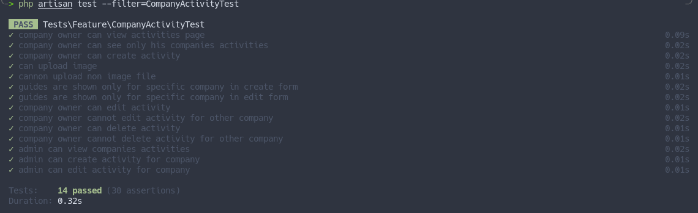

In this lesson, let's build a new feature for managing **activities** and **assigning guides** to them. 

Here's the list of topics that we'll cover below:
- Will create the CRUD for activities.
- Will make it work for both `company owner` and `administrator` users.
- Will add authorization for activities using Policies.
- Will write tests.

---

## Activities CRUD Actions

Again, we can only create CRUD with Controller and Routes. The Controller here will also be nested so that we will have the URLs like `/companies/1/activities`.

```sh
php artisan make:controller CompanyActivityController
```

**routes/web.php**:
```php
use App\Http\Controllers\CompanyActivityController;

Route::middleware('auth')->group(function () {
    // ...

    Route::resource('companies.activities', CompanyActivityController::class); // [tl! ++]
});
```

**Notice**: this is not the first CRUD where we use Nested Controllers, but it's not the only way. In this case, it's just my personal preference to implement multi-tenancy this way, to access records only with their company ID in the URL. You may build CRUDs differently, with URLs like `/activities`, `/guides`, and others, and check `company_id` in another way, like using [Global Scopes](https://laravel.com/docs/10.x/eloquent#global-scopes) with the `auth()->user()->company_id` value.

As for the navigation, we will add the `Activities` link after the `Guides`.

**resources/views/layouts/navigation.blade.php**:
```blade
// ...
<!-- Navigation Links -->
<div class="hidden space-x-8 sm:-my-px sm:ml-10 sm:flex">
    <x-nav-link :href="route('dashboard')" :active="request()->routeIs('dashboard')">
        {{ __('Dashboard') }}
    </x-nav-link>
    @if(auth()->user()->role_id === \App\Enums\Role::ADMINISTRATOR->value)
        <x-nav-link :href="route('companies.index')" :active="request()->routeIs('companies.index')">
            {{ __('Companies') }}
        </x-nav-link>
    @endif
    @if(auth()->user()->role_id === \App\Enums\Role::COMPANY_OWNER->value)
        <x-nav-link :href="route('companies.users.index', auth()->user()->company_id)" :active="request()->routeIs('companies.users.*')">
            {{ __('Administrators') }}
        </x-nav-link>
        <x-nav-link :href="route('companies.guides.index', auth()->user()->company_id)" :active="request()->routeIs('companies.guides.*')">
            {{ __('Guides') }}
        </x-nav-link>
        <x-nav-link :href="route('companies.activities.index', auth()->user()->company_id)" :active="request()->routeIs('companies.activities.*')"> {{-- [tl! add:start] --}}
            {{ __('Activities') }}
        </x-nav-link> {{-- [tl! add:end] --}}
    @endif
</div>
// ...
```


For the validation, again, the [Form Requests](https://laravel.com/docs/validation#form-request-validation).

```sh
php artisan make:request StoreActivityRequest
php artisan make:request UpdateActivityRequest
```

**app/Http/Requests/StoreActivityRequest.php**:
```php
class StoreActivityRequest extends FormRequest
{
    public function authorize(): bool
    {
        return true;
    }

    public function rules(): array
    {
        return [
            'name'        => ['required'],
            'description' => ['required'],
            'start_time'  => ['required', 'date'],
            'price'       => ['required', 'numeric'],
            'image'       => ['image', 'nullable'],
            'guides'      => ['required', 'exists:users,id'],
        ];
    }
}
```

**app/Http/Requests/UpdateActivityRequest.php**:
```php
class UpdateActivityRequest extends FormRequest
{
    public function authorize(): bool
    {
        return true;
    }

    public function rules(): array
    {
        return [
            'name'        => ['required'],
            'description' => ['required'],
            'start_time'  => ['required', 'date'],
            'price'       => ['required', 'numeric'],
            'image'       => ['image', 'nullable'],
            'guides'      => ['required', 'exists:users,id'],
        ];
    }
}
```

Now we can add code to the Controller, show the list of activities, and create and edit forms. 

For storing Blade files, we will use the same structure as in the past lessons, the `resources/views/companies/activities` directory. 

For the photo, for now, it will be just a simple upload stored on a public disk, without any more complex file manipulations or external packages.

**app/Http/Controllers/CompanyActivityController.php**:
```php
use App\Enums\Role;
use App\Models\User;
use App\Models\Company;
use App\Models\Activity;
use Illuminate\Support\Facades\Storage;
use App\Http\Requests\StoreActivityRequest;
use App\Http\Requests\UpdateActivityRequest;

class CompanyActivityController extends Controller
{
    public function index(Company $company)
    {
        $company->load('activities');

        return view('companies.activities.index', compact('company'));
    }

    public function create(Company $company)
    {
        $guides = User::where('company_id', $company->id)
            ->where('role_id', Role::GUIDE->value)
            ->pluck('name', 'id');

        return view('companies.activities.create', compact('guides', 'company'));
    }

    public function store(StoreActivityRequest $request, Company $company)
    {
        if ($request->hasFile('image')) {
            $path = $request->file('image')->store('activities', 'public');
        }

        $activity = Activity::create($request->validated() + [
            'company_id' => $company->id,
            'photo' => $path ?? null,
        ]);

        $activity->participants()->sync($request->input('guides'));

        return to_route('companies.activities.index', $company);
    }

    public function edit(Company $company, Activity $activity)
    {
        $this->authorize('update', $company);

        $guides = User::where('company_id', $company->id)
            ->where('role_id', Role::GUIDE->value)
            ->pluck('name', 'id');

        return view('companies.activities.edit', compact('guides', 'activity', 'company'));
    }

    public function update(UpdateActivityRequest $request, Company $company, Activity $activity)
    {
        if ($request->hasFile('image')) {
            $path = $request->file('image')->store('activities', 'public');
            if ($activity->photo) {
                Storage::disk('public')->delete($activity->photo);
            }
        }

        $activity->update($request->validated() + [
            'photo' => $path ?? $activity->photo,
        ]);

        return to_route('companies.activities.index', $company);
    }

    public function destroy(Company $company, Activity $activity)
    {
        $activity->delete();

        return to_route('companies.activities.index', $company);
    }
}
```

**resources/views/companies/activities/index.blade.php**:
```blade
<x-app-layout>
    <x-slot name="header">
        <h2 class="text-xl font-semibold leading-tight text-gray-800">
            {{ __('Activities') }}
        </h2>
    </x-slot>

    <div class="py-12">
        <div class="mx-auto max-w-7xl sm:px-6 lg:px-8">
            <div class="overflow-hidden bg-white shadow-sm sm:rounded-lg">
                <div class="overflow-hidden overflow-x-auto border-b border-gray-200 bg-white p-6">

                    <a href="{{ route('companies.activities.create', $company) }}"
                       class="mb-4 inline-flex items-center rounded-md border border-gray-300 bg-white px-4 py-2 text-xs font-semibold uppercase tracking-widest text-gray-700 shadow-sm transition duration-150 ease-in-out hover:bg-gray-50 focus:outline-none focus:ring-2 focus:ring-indigo-500 focus:ring-offset-2 disabled:opacity-25">
                        Create
                    </a>

                    <div class="min-w-full align-middle">
                        <table class="min-w-full border divide-y divide-gray-200">
                            <thead>
                            <tr>
                                <th class="bg-gray-50 px-6 py-3 text-left">
                                    <span class="text-xs font-medium uppercase leading-4 tracking-wider text-gray-500"></span>
                                </th>
                                <th class="bg-gray-50 px-6 py-3 text-left">
                                    <span class="text-xs font-medium uppercase leading-4 tracking-wider text-gray-500">Name</span>
                                </th>
                                <th class="bg-gray-50 px-6 py-3 text-left">
                                    <span class="text-xs font-medium uppercase leading-4 tracking-wider text-gray-500">Start time</span>
                                </th>
                                <th class="bg-gray-50 px-6 py-3 text-left">
                                    <span class="text-xs font-medium uppercase leading-4 tracking-wider text-gray-500">Price</span>
                                </th>
                                <th class="w-96 bg-gray-50 px-6 py-3 text-left">
                                </th>
                            </tr>
                            </thead>

                            <tbody class="bg-white divide-y divide-gray-200 divide-solid">
                                @foreach($company->activities as $activity)
                                    <tr class="bg-white">
                                        <td class="px-6 py-4 text-sm leading-5 text-gray-900 whitespace-no-wrap">
                                            @if($activity->photo)
                                                photo) }}" alt="{{ $activity->name }}" class="w-16 h-16 rounded-xl">
                                            @endif
                                        </td>
                                        <td class="px-6 py-4 text-sm leading-5 text-gray-900 whitespace-no-wrap">
                                            {{ $activity->name }}
                                        </td>
                                        <td class="px-6 py-4 text-sm leading-5 text-gray-900 whitespace-no-wrap">
                                            {{ $activity->start_time }}
                                        </td>
                                        <td class="px-6 py-4 text-sm leading-5 text-gray-900 whitespace-no-wrap">
                                            {{ $activity->price }}
                                        </td>
                                        <td class="px-6 py-4 text-sm leading-5 text-gray-900 whitespace-no-wrap">
                                            <a href="{{ route('companies.activities.edit', [$company, $activity]) }}"
                                               class="inline-flex items-center rounded-md border border-gray-300 bg-white px-4 py-2 text-xs font-semibold uppercase tracking-widest text-gray-700 shadow-sm transition duration-150 ease-in-out hover:bg-gray-50 focus:outline-none focus:ring-2 focus:ring-indigo-500 focus:ring-offset-2 disabled:opacity-25">
                                                Edit
                                            </a>
                                            <form action="{{ route('companies.activities.destroy', [$company, $activity]) }}" method="POST" onsubmit="return confirm('Are you sure?')" style="display: inline-block;">
                                                @csrf
                                                @method('DELETE')
                                                <x-danger-button>
                                                    Delete
                                                </x-danger-button>
                                            </form>
                                        </td>
                                    </tr>
                                @endforeach
                            </tbody>
                        </table>
                    </div>
                </div>
            </div>
        </div>
    </div>
</x-app-layout>
```


Because we are saving the price in cents, before adding value to the DB, we need to multiply it by 100. And the other way around: to show the correct value in the front end, we need to divide by 100. We will use [Accessors & Mutators](https://laravel.com/docs/eloquent-mutators#accessors-and-mutators) for this.

**app/Models/Activity.php**:
```php
use Illuminate\Database\Eloquent\Casts\Attribute;

class Activity extends Model
{
    // ...

    public function price(): Attribute
    {
        return Attribute::make(
            get: fn($value) => $value / 100,
            set: fn($value) => $value * 100,
        );
    }   
}
```

**resources/views/companies/activities/create.blade.php**:
```blade
<x-app-layout>
    <x-slot name="header">
        <h2 class="text-xl font-semibold leading-tight text-gray-800">
            {{ __('Create Activity') }}
        </h2>
    </x-slot>

    <div class="py-12">
        <div class="mx-auto max-w-7xl sm:px-6 lg:px-8">
            <div class="overflow-hidden bg-white shadow-sm sm:rounded-lg">
                <div class="overflow-hidden overflow-x-auto border-b border-gray-200 bg-white p-6">
                    <form action="{{ route('companies.activities.store', $company) }}" method="POST" enctype="multipart/form-data">
                        @csrf

                        <div>
                            <x-input-label for="name" value="Name" />
                            <x-text-input id="name" name="name" value="{{ old('name') }}" type="text" class="mt-1 block w-full" />
                            <x-input-error :messages="$errors->get('name')" class="mt-2" />
                        </div>

                        <div class="mt-4">
                            <x-input-label for="description" value="Description" />
                            <textarea id="description" name="description" class="mt-1 block w-full rounded-md border-gray-300 shadow-sm focus:border-indigo-500 focus:ring-indigo-500">{{ old('description') }}</textarea>
                            <x-input-error :messages="$errors->get('description')" class="mt-2" />
                        </div>

                        <div class="mt-4">
                            <x-input-label for="start_time" value="Start time" />
                            <x-text-input id="start_time" name="start_time" value="{{ old('start_time') }}" type="datetime-local" class="mt-1 block w-full" />
                            <x-input-error :messages="$errors->get('start_time')" class="mt-2" />
                        </div>

                        <div class="mt-4">
                            <x-input-label for="price" value="Price" />
                            <x-text-input id="price" name="price" value="{{ old('price') }}" type="number" step="0.01" class="mt-1 block w-full" />
                            <x-input-error :messages="$errors->get('price')" class="mt-2" />
                        </div>

                        <div class="mt-4">
                            <x-input-label for="image" value="Photo" />
                            <x-text-input id="image" name="image" type="file" class="mt-1 block w-full" />
                            <x-input-error :messages="$errors->get('image')" class="mt-2" />
                        </div>

                        <div class="mt-4">
                            <x-input-label for="guides" value="Guides" />
                            <select name="guides" id="guides" class="mt-1 block w-full rounded-md border-gray-300 shadow-sm focus:border-indigo-500 focus:ring-indigo-500">
                                <option>-- SELECT GUIDE --</option>
                                @foreach($guides as $id => $name)
                                    <option value="{{ $id }}" @selected(old('guides') == $id)>{{ $name }}</option>
                                @endforeach
                            </select>
                        </div>

                        <div class="mt-4">
                            <x-primary-button>
                                Save
                            </x-primary-button>
                        </div>
                    </form>
                </div>
            </div>
        </div>
    </div>
</x-app-layout>
```


**resources/views/companies/activities/edit.blade.php**:
```blade
<x-app-layout>
    <x-slot name="header">
        <h2 class="text-xl font-semibold leading-tight text-gray-800">
            {{ __('Edit Activity') }}
        </h2>
    </x-slot>

    <div class="py-12">
        <div class="mx-auto max-w-7xl sm:px-6 lg:px-8">
            <div class="overflow-hidden bg-white shadow-sm sm:rounded-lg">
                <div class="overflow-hidden overflow-x-auto border-b border-gray-200 bg-white p-6">
                    <form action="{{ route('companies.activities.update', [$company, $activity]) }}" method="POST" enctype="multipart/form-data">
                        @csrf
                        @method('PUT')

                        <div>
                            <x-input-label for="name" value="Name" />
                            <x-text-input id="name" name="name" value="{{ old('name', $activity->name) }}" type="text" class="mt-1 block w-full" />
                            <x-input-error :messages="$errors->get('name')" class="mt-2" />
                        </div>

                        <div class="mt-4">
                            <x-input-label for="description" value="Description" />
                            <textarea id="description" name="description" class="mt-1 block w-full rounded-md border-gray-300 shadow-sm focus:border-indigo-500 focus:ring-indigo-500">{{ old('description', $activity->description) }}</textarea>
                            <x-input-error :messages="$errors->get('description')" class="mt-2" />
                        </div>

                        <div class="mt-4">
                            <x-input-label for="start_time" value="Start time" />
                            <x-text-input id="start_time" name="start_time" value="{{ old('start_time', $activity->start_time) }}" type="datetime-local" class="mt-1 block w-full" />
                            <x-input-error :messages="$errors->get('start_time')" class="mt-2" />
                        </div>

                        <div class="mt-4">
                            <x-input-label for="price" value="Price" />
                            <x-text-input id="price" name="price" value="{{ old('price', $activity->price) }}" type="number" step="0.01" class="mt-1 block w-full" />
                            <x-input-error :messages="$errors->get('price')" class="mt-2" />
                        </div>

                        <div class="mt-4">
                            @if($activity->photo)
                                photo) }}" alt="{{ $activity->name }}" class="mb-4 h-48 w-48 rounded-xl">
                            @endif

                            <x-input-label for="image" value="Photo" />
                            <x-text-input id="image" name="image" type="file" class="mt-1 block w-full" />
                            <x-input-error :messages="$errors->get('image')" class="mt-2" />
                        </div>

                        <div class="mt-4">
                            <x-input-label for="guides" value="Guides" />
                            <select name="guides" id="guides" class="mt-1 block w-full rounded-md border-gray-300 shadow-sm focus:border-indigo-500 focus:ring-indigo-500">
                                <option>-- SELECT GUIDE --</option>
                                @foreach($guides as $id => $name)
                                    <option value="{{ $id }}" @selected(old('guides', $activity->participants->contains($id)))>{{ $name }}</option>
                                @endforeach
                            </select>
                        </div>

                        <div class="mt-4">
                            <x-primary-button>
                                Save
                            </x-primary-button>
                        </div>
                    </form>
                </div>
            </div>
        </div>
    </div>
</x-app-layout>
```


---

## Authorization

Of course, only hiding the navigation isn't secure enough. To keep consistency, we will use Policies. Let's create a Policy and register it.

```sh
php artisan make:policy CompanyActivityPolicy --model=Activity
```

**app/Provides/AuthServiceProvider.php**:
```php
use App\Models\Activity;
use App\Policies\ActivityPolicy;

class AuthServiceProvider extends ServiceProvider
{
    protected $policies = [
        Company::class => CompanyUserPolicy::class,
        Activity::class => CompanyActivityPolicy::class, // [tl! ++]
    ];

    // ...
}
```

In the Policy, we will check if the user has the `Company Owner` role and is doing the action for his company.

But for the `administrator` role, we just need to allow **everything** as we did in the `CompanyUserPolicy`. So, we will use the `before` [Policy Filter](https://laravel.com/docs/authorization#authorizing-actions-using-policies) method again. In this method, we will return `true` if the user has the role of `administrator`.

**app/Policies/ActivityPolicity**:
```php
use App\Enums\Role;
use App\Models\Company;
use App\Models\Activity;
use App\Models\User;

class CompanyActivityPolicy
{
    public function before(User $user): bool|null
    {
        if ($user->role_id === Role::ADMINISTRATOR->value) {
            return true;
        }

        return null;
    }

    public function viewAny(User $user, Company $company): bool
    {
        return $user->role_id === Role::COMPANY_OWNER->value && $user->company_id === $company->id;
    }
    
    public function create(User $user, Company $company): bool
    {
        return $user->role_id === Role::COMPANY_OWNER->value && $user->company_id === $company->id;
    }

    public function update(User $user, Activity $activity): bool
    {
        return $user->role_id === Role::COMPANY_OWNER->value && $user->company_id === $activity->company_id;
    }

    public function delete(User $user, Activity $activity): bool
    {
        return $user->role_id === Role::COMPANY_OWNER->value && $user->company_id === $activity->company_id;
    }
}
```

Next, we need to use this Policy in the Controller. Because here we are using a simple Resource Controller, we can use the [authorizeResource](https://laravel.com/docs/authorization#authorizing-resource-controllers) method in the Controller's constructor.

Next, in the `CompanyActivityController`, we must do the `authorize` check for each CRUD action. Again, there are a couple of ways to do that, but I will use the [`authorize`](https://laravel.com/docs/authorization#via-controller-helpers) method for consistency.

**app/Http/Controllers/ActivityController.php**:
```php
class CompanyActivityController extends Controller
{
    public function index(Company $company)
    {
        $this->authorize('viewAny', $company); // [tl! ++]

        // ...
    }

    public function create(Company $company)
    {
        $this->authorize('create', $company); // [tl! ++]

        // ...
    }

    public function store(StoreActivityRequest $request, Company $company)
    {
        $this->authorize('create', $company); // [tl! ++]

        // ...
    }

    public function edit(Company $company, Activity $activity)
    {
        $this->authorize('update', $company); // [tl! ++]

        // ...
    }

    public function update(UpdateActivityRequest $request, Company $company, Activity $activity)
    {
        $this->authorize('update', $company); // [tl! ++]

        // ...
    }

    public function destroy(Company $company, Activity $activity)
    {
        $this->authorize('delete', $company); // [tl! ++]

        // ...
    }
}
```

---

## Showing Activities for Administrator User

For showing the activities of every company for the `administrator` user, we already have made all the logic. We just need to add a link to the Companies list so administrators can access that page.

**resources/views/companies/index.blade.php**:
```blade
// ...
<td class="px-6 py-4 text-sm leading-5 text-gray-900 whitespace-no-wrap">
    <a href="{{ route('companies.users.index', $company) }}"
       class="inline-flex items-center rounded-md border border-gray-300 bg-white px-4 py-2 text-xs font-semibold uppercase tracking-widest text-gray-700 shadow-sm transition duration-150 ease-in-out hover:bg-gray-50 focus:outline-none focus:ring-2 focus:ring-indigo-500 focus:ring-offset-2 disabled:opacity-25">
        Users
    </a>
    <a href="{{ route('companies.activities.index', $company) }}" {{-- [tl! add:start] --}}
       class="inline-flex items-center rounded-md border border-gray-300 bg-white px-4 py-2 text-xs font-semibold uppercase tracking-widest text-gray-700 shadow-sm transition duration-150 ease-in-out hover:bg-gray-50 focus:outline-none focus:ring-2 focus:ring-indigo-500 focus:ring-offset-2 disabled:opacity-25">
        Activities
    </a> {{-- [tl! add:end] --}}
    
    {{-- ... Edit/Delete buttons --}}
</td>
// ...
```

---

## Tests

As with every feature, we add tests, no exception here. First, because we are working with the `Activity` Model, we need to create a Factory for it.

```sh
php artisan make:factory ActivityFactory
```

**app/database/factories/ActivityFactory.php**:
```php
use App\Models\Company;
use Illuminate\Support\Carbon;

class ActivityFactory extends Factory
{
    public function definition(): array
    {
        return [
            'company_id'  => Company::factory(),
            'name'        => fake()->name(),
            'description' => fake()->text(),
            'start_time'  => Carbon::now(),
            'price'       => fake()->randomNumber(5),
        ];
    }
}
```

Now the test.

```sh
php artisan make:test CompanyActivityTest
```

So, what do we need to test here? Permissions, probably: the `Company Owner` needs to perform every action only for their company. 

So, we need to test the following:

- For the activities list: test that the company owner can see only their company's activities and cannot see other companies.
- For create, edit, and delete: it's the same, and we have already written similar tests in the `CompanyGuideTest`.
- In the create and edit, the list of the guides should be visible only from that company.
- Image upload shouldn't allow uploading non-image files.
- Administrator user can perform every CRUD action.

**tests/Feature/ActivityTest.php**:
```php
<?php

namespace Tests\Feature;

use Tests\TestCase;
use App\Models\User;
use App\Models\Company;
use App\Models\Activity;
use Illuminate\Http\UploadedFile;
use Illuminate\Support\Collection;
use Illuminate\Support\Facades\Storage;
use Illuminate\Foundation\Testing\RefreshDatabase;

class CompanyActivityTest extends TestCase
{
    use RefreshDatabase;

    public function test_company_owner_can_view_activities_page()
    {
        $company = Company::factory()->create();
        $user = User::factory()->companyOwner()->create(['company_id' => $company->id]);

        $response = $this->actingAs($user)->get(route('companies.activities.index', $company, $company));

        $response->assertOk();
    }

    public function test_company_owner_can_see_only_his_companies_activities()
    {
        $company = Company::factory()->create();
        $user = User::factory()->companyOwner()->create(['company_id' => $company->id]);
        $activity = Activity::factory()->create(['company_id' => $company->id]);
        $activity2 = Activity::factory()->create();

        $response = $this->actingAs($user)->get(route('companies.activities.index', $company));

        $response->assertSeeText($activity->name)
            ->assertDontSeeText($activity2->name);
    }

    public function test_company_owner_can_create_activity()
    {
        $company = Company::factory()->create();
        $user = User::factory()->companyOwner()->create(['company_id' => $company->id]);
        $guide = User::factory()->guide()->create();

        $response = $this->actingAs($user)->post(route('companies.activities.store', $company), [
            'name' => 'activity',
            'description' => 'description',
            'start_time' => '2023-09-01 10:00',
            'price' => 9999,
            'guides' => $guide->id,
        ]);

        $response->assertRedirect(route('companies.activities.index', $company));

        $this->assertDatabaseHas('activities', [
            'company_id' => $company->id,
            'name' => 'activity',
            'description' => 'description',
            'start_time' => '2023-09-01 10:00',
            'price' => 999900,
        ]);
    }

    public function test_can_upload_image()
    {
        Storage::fake('activities');

        $company = Company::factory()->create();
        $user = User::factory()->companyOwner()->create(['company_id' => $company->id]);
        $guide = User::factory()->guide()->create();

        $file = UploadedFile::fake()->image('avatar.jpg');

        $this->actingAs($user)->post(route('companies.activities.store', $company), [
            'name' => 'activity',
            'description' => 'description',
            'start_time' => '2023-09-01 10:00',
            'price' => 9999,
            'guides' => $guide->id,
            'image' => $file,
        ]);

        Storage::disk('public')->assertExists('activities/' . $file->hashName());
    }

    public function test_cannon_upload_non_image_file()
    {
        Storage::fake('activities');

        $company = Company::factory()->create();
        $user = User::factory()->companyOwner()->create(['company_id' => $company->id]);
        $guide = User::factory()->guide()->create();

        $file = UploadedFile::fake()->create('document.pdf', 2000, 'application/pdf');

        $response = $this->actingAs($user)->post(route('companies.activities.store', $company), [
            'name' => 'activity',
            'description' => 'description',
            'start_time' => '2023-09-01 10:00',
            'price' => 9999,
            'guides' => $guide->id,
            'image' => $file,
        ]);

        $response->assertSessionHasErrors(['image']);

        Storage::disk('public')->assertMissing('activities/' . $file->hashName());
    }

    public function test_guides_are_shown_only_for_specific_company_in_create_form()
    {
        $company = Company::factory()->create();
        $user = User::factory()->companyOwner()->create(['company_id' => $company->id]);
        $guide = User::factory()->guide()->create(['company_id' => $company->id]);

        $company2 = Company::factory()->create();
        $guide2 = User::factory()->guide()->create(['company_id' => $company2->id]);

        $response = $this->actingAs($user)->get(route('companies.activities.create', $company));

        $response->assertViewHas('guides', function (Collection $guides) use ($guide) {
            return $guide->name === $guides[$guide->id];
        });

        $response->assertViewHas('guides', function (Collection $guides) use ($guide2) {
            return ! array_key_exists($guide2->id, $guides->toArray());
        });
    }

    public function test_guides_are_shown_only_for_specific_company_in_edit_form()
    {
        $company = Company::factory()->create();
        $user = User::factory()->companyOwner()->create(['company_id' => $company->id]);
        $guide = User::factory()->guide()->create(['company_id' => $company->id]);
        $activity = Activity::factory()->create(['company_id' => $company->id]);

        $company2 = Company::factory()->create();
        $guide2 = User::factory()->guide()->create(['company_id' => $company2->id]);

        $response = $this->actingAs($user)->get(route('companies.activities.edit', [$company, $activity]));

        $response->assertViewHas('guides', function (Collection $guides) use ($guide) {
            return $guide->name === $guides[$guide->id];
        });

        $response->assertViewHas('guides', function (Collection $guides) use ($guide2) {
            return ! array_key_exists($guide2->id, $guides->toArray());
        });
    }

    public function test_company_owner_can_edit_activity()
    {
        $company = Company::factory()->create();
        $user = User::factory()->companyOwner()->create(['company_id' => $company->id]);
        $guide = User::factory()->guide()->create();
        $activity = Activity::factory()->create(['company_id' => $company->id]);

        $response = $this->actingAs($user)->put(route('companies.activities.update', [$company, $activity]), [
            'name' => 'activity',
            'description' => 'description',
            'start_time' => '2023-09-01 10:00',
            'price' => 9999,
            'guides' => $guide->id,
        ]);

        $response->assertRedirect(route('companies.activities.index', $company));

        $this->assertDatabaseHas('activities', [
            'company_id' => $company->id,
            'name' => 'activity',
            'description' => 'description',
            'start_time' => '2023-09-01 10:00',
            'price' => 999900,
        ]);
    }

    public function test_company_owner_cannot_edit_activity_for_other_company()
    {
        $company = Company::factory()->create();
        $company2 = Company::factory()->create();
        $user = User::factory()->companyOwner()->create(['company_id' => $company->id]);
        $guide = User::factory()->guide()->create();
        $activity = Activity::factory()->create(['company_id' => $company2->id]);

        $response = $this->actingAs($user)->put(route('companies.activities.update', [$company2, $activity]), [
            'name' => 'activity',
            'description' => 'description',
            'start_time' => '2023-09-01 10:00',
            'price' => 9999,
            'guides' => $guide->id,
        ]);

        $response->assertForbidden();
    }

    public function test_company_owner_can_delete_activity()
    {
        $company = Company::factory()->create();
        $user = User::factory()->companyOwner()->create(['company_id' => $company->id]);
        $activity = Activity::factory()->create(['company_id' => $company->id]);

        $response = $this->actingAs($user)->delete(route('companies.activities.destroy', [$company, $activity]));

        $response->assertRedirect(route('companies.activities.index', $company));

        $this->assertModelMissing($activity);
    }

    public function test_company_owner_cannot_delete_activity_for_other_company()
    {
        $company = Company::factory()->create();
        $company2 = Company::factory()->create();
        $user = User::factory()->companyOwner()->create(['company_id' => $company->id]);
        $activity = Activity::factory()->create(['company_id' => $company2->id]);

        $response = $this->actingAs($user)->delete(route('companies.activities.destroy', [$company2, $activity]));

        $this->assertModelExists($activity);
        $response->assertForbidden();
    }

    public function test_admin_can_view_companies_activities()
    {
        $company = Company::factory()->create();
        $user = User::factory()->admin()->create();

        $response = $this->actingAs($user)->get(route('companies.activities.index', $company, $company));

        $response->assertOk();
    }

    public function test_admin_can_create_activity_for_company()
    {
        $company = Company::factory()->create();
        $user = User::factory()->admin()->create();
        $guide = User::factory()->guide()->create();

        $response = $this->actingAs($user)->post(route('companies.activities.store', $company->id), [
            'name' => 'activity',
            'description' => 'description',
            'start_time' => '2023-09-01 10:00',
            'price' => 9999,
            'guides' => $guide->id,
        ]);

        $response->assertRedirect(route('companies.activities.index', $company->id));

        $this->assertDatabaseHas('activities', [
            'company_id' => $company->id,
            'name' => 'activity',
            'description' => 'description',
            'start_time' => '2023-09-01 10:00',
            'price' => 999900,
        ]);
    }

    public function test_admin_can_edit_activity_for_company()
    {
        $company = Company::factory()->create();
        $user = User::factory()->admin()->create();
        $guide = User::factory()->guide()->create();
        $activity = Activity::factory()->create(['company_id' => $company->id]);

        $response = $this->actingAs($user)->put(route('companies.activities.update', [$company, $activity]), [
            'name' => 'activity',
            'description' => 'description',
            'start_time' => '2023-09-01 10:00',
            'price' => 9999,
            'guides' => $guide->id,
        ]);

        $response->assertRedirect(route('companies.activities.index', $company));

        $this->assertDatabaseHas('activities', [
            'company_id' => $company->id,
            'name' => 'activity',
            'description' => 'description',
            'start_time' => '2023-09-01 10:00',
            'price' => 999900,
        ]);
    }
}
```



I think we created enough functionality to show it to the client and see what they say so far. Such a feedback loop is very important: the earlier we learn about the changes, the less code refactoring we need.

In the next lesson, we will make changes according to the client's feedback.