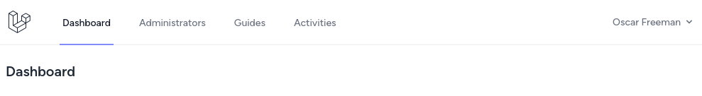
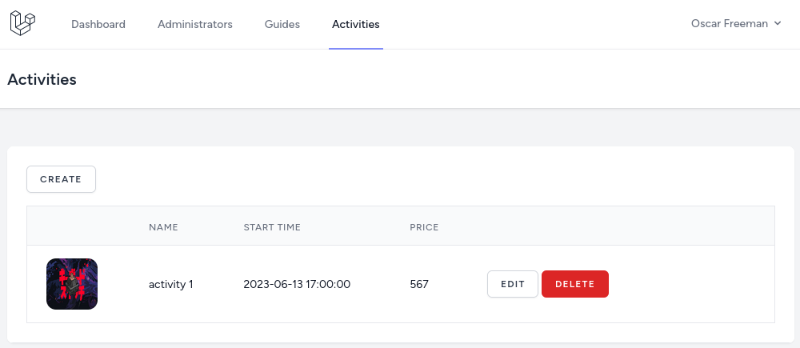
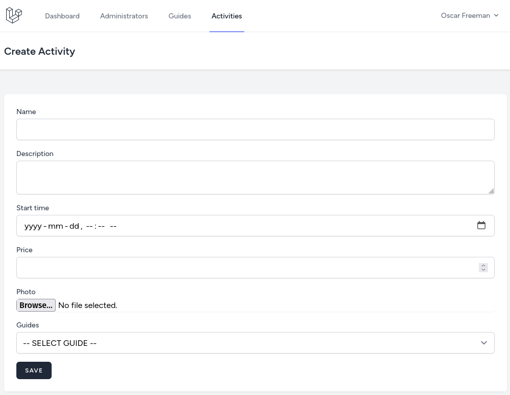
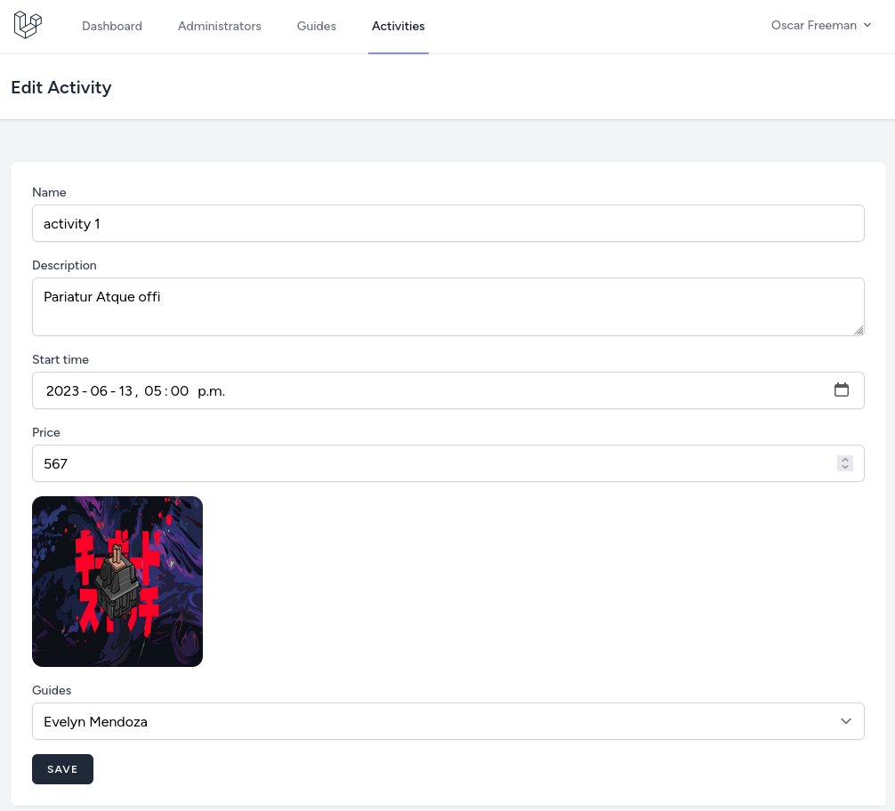

In this lesson, let's build a new feature for managing activities and assigning guides to them. Of course, we will write tests for this feature at the end.

Here's the list of topics that we'll cover below:
- Will create the CRUD for activities.
- Will add authorization for activities using Policies.
- Will write tests.

---

## Activities CRUD Actions

Again, we can only create CRUD with Controller and Routes.

```sh
php artisan make:controller ActivityController
```

**routes/web.php**:
```php
use App\Http\Controllers\ActivityController;

Route::middleware('auth')->group(function () {
    // ...

    Route::resource('activities', ActivityController::class); // [tl! ++]
});
```

As for the navigation link, `Activities` will be visible only for `Company Owner` users. So, we will add a link below the `Guides`.

**resources/views/layouts/navigation.blade.php**:
```blade
// ...
<!-- Navigation Links -->
<div class="hidden space-x-8 sm:-my-px sm:ml-10 sm:flex">
    <x-nav-link :href="route('dashboard')" :active="request()->routeIs('dashboard')">
        {{ __('Dashboard') }}
    </x-nav-link>
    @if(auth()->user()->role_id === \App\Enums\Role::ADMINISTRATOR->value)
        <x-nav-link :href="route('companies.index')" :active="request()->routeIs('companies.index')">
            {{ __('Companies') }}
        </x-nav-link>
    @endif
    @if(auth()->user()->role_id === \App\Enums\Role::COMPANY_OWNER->value)
        <x-nav-link :href="route('companies.users.index', auth()->user()->company_id)" :active="request()->routeIs('companies.users.*')">
            {{ __('Administrators') }}
        </x-nav-link>
        <x-nav-link :href="route('companies.guides.index', auth()->user()->company_id)" :active="request()->routeIs('companies.guides.*')">
            {{ __('Guides') }}
        </x-nav-link>
        <x-nav-link :href="route('activities.index')" :active="request()->routeIs('activities.*')"> {{-- [tl! add:start] --}}
            {{ __('Activities') }}
        </x-nav-link> {{-- [tl! add:end] --}}
    @endif
</div>
// ...
```



For the validation, again, the [Form Requests](https://laravel.com/docs/validation#form-request-validation).

```sh
php artisan make:request StoreActivityRequest
php artisan make:request UpdateActivityRequest
```

**app/Http/Requests/StoreActivityRequest.php**:
```php
class StoreActivityRequest extends FormRequest
{
    public function authorize(): bool
    {
        return true;
    }

    public function rules(): array
    {
        return [
            'name'        => ['required'],
            'description' => ['required'],
            'start_time'  => ['required', 'date'],
            'price'       => ['required', 'integer'],
            'image'       => ['image', 'nullable'],
            'guides'      => ['required', 'exists:users,id'],
        ];
    }
}
```

**app/Http/Requests/UpdateActivityRequest.php**:
```php
class UpdateActivityRequest extends FormRequest
{
    public function authorize(): bool
    {
        return true;
    }

    public function rules(): array
    {
        return [
            'name'        => ['required'],
            'description' => ['required'],
            'start_time'  => ['required', 'date'],
            'price'       => ['required', 'integer'],
            'image'       => ['image', 'nullable'],
            'guides'      => ['required', 'exists:users,id'],
        ];
    }
}
```

Now we can add code to the Controller, show the list of activities, and create and edit forms. For storing Blade files, we will use the same structure as we used for companies, the `resources/views/activities` directory. For the photo, now it will be just a simple upload stored on a public disk.

**app/Http/Controllers/ActivityController.php**:
```php
use App\Enums\Role;
use App\Models\User;
use App\Models\Activity;
use App\Http\Requests\StoreActivityRequest;
use App\Http\Requests\UpdateActivityRequest;

class ActivityController extends Controller
{
    public function index()
    {
        $activities = auth()->user()->company()
            ->with('activities')
            ->get()
            ->pluck('activities')
            ->flatten();

        return view('activities.index', compact('activities'));
    }

    public function create()
    {
        $users = User::where('company_id', auth()->user()->company_id)
            ->where('role_id', Role::GUIDE)
            ->pluck('name', 'id');

        return view('activities.create', compact('users'));
    }

    public function store(StoreActivityRequest $request)
    {
        if ($request->hasFile('image')) {
            $path = $request->file('image')->store('activities', 'public');
        }

        $activity = Activity::create($request->validated() + [
            'company_id' => auth()->user()->company_id,
            'photo' => $path ?? null,
        ]);

        $activity->participants()->sync($request->input('guides'));

        return to_route('activities.index');
    }

    public function edit(Activity $activity)
    {
        $users = User::where('company_id', auth()->user()->company_id)
            ->where('role_id', Role::GUIDE)
            ->pluck('name', 'id');

        return view('activities.edit', compact('users', 'activity'));
    }

    public function update(UpdateActivityRequest $request, Activity $activity)
    {
        if ($request->hasFile('image')) {
            $path = $request->file('image')->store('activities', 'public');
            if ($activity->photo) {
                Storage::disk('public')->delete($activity->photo);
            }
        }

        $activity->update($request->validated() + [
            'photo' => $path ?? $activity->photo,
        ]);

        return to_route('activities.index');
    }

    public function destroy(Activity $activity)
    {
        $activity->delete();

        return to_route('activities.index');
    }
}
```

**resources/views/activities/index.blade.php**:
```blade
<x-app-layout>
    <x-slot name="header">
        <h2 class="text-xl font-semibold leading-tight text-gray-800">
            {{ __('Activities') }}
        </h2>
    </x-slot>

    <div class="py-12">
        <div class="mx-auto max-w-7xl sm:px-6 lg:px-8">
            <div class="overflow-hidden bg-white shadow-sm sm:rounded-lg">
                <div class="overflow-hidden overflow-x-auto border-b border-gray-200 bg-white p-6">

                    <a href="{{ route('activities.create') }}"
                       class="mb-4 inline-flex items-center rounded-md border border-gray-300 bg-white px-4 py-2 text-xs font-semibold uppercase tracking-widest text-gray-700 shadow-sm transition duration-150 ease-in-out hover:bg-gray-50 focus:outline-none focus:ring-2 focus:ring-indigo-500 focus:ring-offset-2 disabled:opacity-25">
                        Create
                    </a>

                    <div class="min-w-full align-middle">
                        <table class="min-w-full border divide-y divide-gray-200">
                            <thead>
                            <tr>
                                <th class="bg-gray-50 px-6 py-3 text-left">
                                    <span class="text-xs font-medium uppercase leading-4 tracking-wider text-gray-500"></span>
                                </th>
                                <th class="bg-gray-50 px-6 py-3 text-left">
                                    <span class="text-xs font-medium uppercase leading-4 tracking-wider text-gray-500">Name</span>
                                </th>
                                <th class="bg-gray-50 px-6 py-3 text-left">
                                    <span class="text-xs font-medium uppercase leading-4 tracking-wider text-gray-500">Start time</span>
                                </th>
                                <th class="bg-gray-50 px-6 py-3 text-left">
                                    <span class="text-xs font-medium uppercase leading-4 tracking-wider text-gray-500">Price</span>
                                </th>
                                <th class="w-96 bg-gray-50 px-6 py-3 text-left">
                                </th>
                            </tr>
                            </thead>

                            <tbody class="bg-white divide-y divide-gray-200 divide-solid">
                                @foreach($activities as $activity)
                                    <tr class="bg-white">
                                        <td class="px-6 py-4 text-sm leading-5 text-gray-900 whitespace-no-wrap">
                                            @if($activity->photo)
                                                photo) }}" alt="{{ $activity->name }}" class="w-16 h-16 rounded-xl">
                                            @endif
                                        </td>
                                        <td class="px-6 py-4 text-sm leading-5 text-gray-900 whitespace-no-wrap">
                                            {{ $activity->name }}
                                        </td>
                                        <td class="px-6 py-4 text-sm leading-5 text-gray-900 whitespace-no-wrap">
                                            {{ $activity->start_time }}
                                        </td>
                                        <td class="px-6 py-4 text-sm leading-5 text-gray-900 whitespace-no-wrap">
                                            {{ $activity->price }}
                                        </td>
                                        <td class="px-6 py-4 text-sm leading-5 text-gray-900 whitespace-no-wrap">
                                            <a href="{{ route('activities.edit', $activity) }}"
                                               class="inline-flex items-center rounded-md border border-gray-300 bg-white px-4 py-2 text-xs font-semibold uppercase tracking-widest text-gray-700 shadow-sm transition duration-150 ease-in-out hover:bg-gray-50 focus:outline-none focus:ring-2 focus:ring-indigo-500 focus:ring-offset-2 disabled:opacity-25">
                                                Edit
                                            </a>
                                            <form action="{{ route('activities.destroy', $activity) }}" method="POST" onsubmit="return confirm('Are you sure?')" style="display: inline-block;">
                                                @csrf
                                                @method('DELETE')
                                                <x-danger-button>
                                                    Delete
                                                </x-danger-button>
                                            </form>
                                        </td>
                                    </tr>
                                @endforeach
                            </tbody>
                        </table>
                    </div>
                </div>
            </div>
        </div>
    </div>
</x-app-layout>
```



**resources/views/activities/create.blade.php**:
```blade
<x-app-layout>
    <x-slot name="header">
        <h2 class="text-xl font-semibold leading-tight text-gray-800">
            {{ __('Create Activity') }}
        </h2>
    </x-slot>

    <div class="py-12">
        <div class="mx-auto max-w-7xl sm:px-6 lg:px-8">
            <div class="overflow-hidden bg-white shadow-sm sm:rounded-lg">
                <div class="overflow-hidden overflow-x-auto border-b border-gray-200 bg-white p-6">
                    <form action="{{ route('activities.store') }}" method="POST" enctype="multipart/form-data">
                        @csrf

                        <div>
                            <x-input-label for="name" value="Name" />
                            <x-text-input id="name" name="name" value="{{ old('name') }}" type="text" class="mt-1 block w-full" />
                            <x-input-error :messages="$errors->get('name')" class="mt-2" />
                        </div>

                        <div class="mt-4">
                            <x-input-label for="description" value="Description" />
                            <textarea id="description" name="description" class="mt-1 block w-full rounded-md border-gray-300 shadow-sm focus:border-indigo-500 focus:ring-indigo-500">{{ old('description') }}</textarea>
                            <x-input-error :messages="$errors->get('description')" class="mt-2" />
                        </div>

                        <div class="mt-4">
                            <x-input-label for="start_time" value="Start time" />
                            <x-text-input id="start_time" name="start_time" value="{{ old('start_time') }}" type="datetime-local" class="mt-1 block w-full" />
                            <x-input-error :messages="$errors->get('start_time')" class="mt-2" />
                        </div>

                        <div class="mt-4">
                            <x-input-label for="price" value="Price" />
                            <x-text-input id="price" name="price" value="{{ old('price') }}" type="number" step="0.01" class="mt-1 block w-full" />
                            <x-input-error :messages="$errors->get('price')" class="mt-2" />
                        </div>

                        <div class="mt-4">
                            <x-input-label for="image" value="Photo" />
                            <x-text-input id="image" name="image" type="file" class="mt-1 block w-full" />
                            <x-input-error :messages="$errors->get('image')" class="mt-2" />
                        </div>

                        <div class="mt-4">
                            <x-input-label for="guides" value="Guides" />
                            <select name="guides" id="guides" class="mt-1 block w-full rounded-md border-gray-300 shadow-sm focus:border-indigo-500 focus:ring-indigo-500">
                                <option>-- SELECT GUIDE --</option>
                                @foreach($users as $id => $name)
                                    <option value="{{ $id }}" @selected(old('guides') == $id)>{{ $name }}</option>
                                @endforeach
                            </select>
                        </div>

                        <div class="mt-4">
                            <x-primary-button>
                                Save
                            </x-primary-button>
                        </div>
                    </form>
                </div>
            </div>
        </div>
    </div>
</x-app-layout>
```



**resources/views/activities/edit.blade.php**:
```blade
<x-app-layout>
    <x-slot name="header">
        <h2 class="text-xl font-semibold leading-tight text-gray-800">
            {{ __('Edit Activity') }}
        </h2>
    </x-slot>

    <div class="py-12">
        <div class="mx-auto max-w-7xl sm:px-6 lg:px-8">
            <div class="overflow-hidden bg-white shadow-sm sm:rounded-lg">
                <div class="overflow-hidden overflow-x-auto border-b border-gray-200 bg-white p-6">
                    <form action="{{ route('activities.update', $activity) }}" method="POST" enctype="multipart/form-data">
                        @csrf
                        @method('PUT')

                        <div>
                            <x-input-label for="name" value="Name" />
                            <x-text-input id="name" name="name" value="{{ old('name', $activity->name) }}" type="text" class="mt-1 block w-full" />
                            <x-input-error :messages="$errors->get('name')" class="mt-2" />
                        </div>

                        <div class="mt-4">
                            <x-input-label for="description" value="Description" />
                            <textarea id="description" name="description" class="mt-1 block w-full rounded-md border-gray-300 shadow-sm focus:border-indigo-500 focus:ring-indigo-500">{{ old('description', $activity->description) }}</textarea>
                            <x-input-error :messages="$errors->get('description')" class="mt-2" />
                        </div>

                        <div class="mt-4">
                            <x-input-label for="start_time" value="Start time" />
                            <x-text-input id="start_time" name="start_time" value="{{ old('start_time', $activity->start_time) }}" type="datetime-local" class="mt-1 block w-full" />
                            <x-input-error :messages="$errors->get('start_time')" class="mt-2" />
                        </div>

                        <div class="mt-4">
                            <x-input-label for="price" value="Price" />
                            <x-text-input id="price" name="price" value="{{ old('price', $activity->price) }}" type="number" step="0.01" class="mt-1 block w-full" />
                            <x-input-error :messages="$errors->get('price')" class="mt-2" />
                        </div>

                        <div class="mt-4">
                            @if($activity->photo)
                                photo) }}" alt="{{ $activity->name }}" class="mb-4 h-48 w-48 rounded-xl">
                            @endif

                            <x-input-label for="image" value="Photo" />
                            <x-text-input id="image" name="image" type="file" class="mt-1 block w-full" />
                            <x-input-error :messages="$errors->get('image')" class="mt-2" />
                        </div>

                        <div class="mt-4">
                            <x-input-label for="guides" value="Guides" />
                            <select name="guides" id="guides" class="mt-1 block w-full rounded-md border-gray-300 shadow-sm focus:border-indigo-500 focus:ring-indigo-500">
                                <option>-- SELECT GUIDE --</option>
                                @foreach($users as $id => $name)
                                    <option value="{{ $id }}" @selected(old('guides', $activity->participants->contains($id)))>{{ $name }}</option>
                                @endforeach
                            </select>
                        </div>

                        <div class="mt-4">
                            <x-primary-button>
                                Save
                            </x-primary-button>
                        </div>
                    </form>
                </div>
            </div>
        </div>
    </div>
</x-app-layout>
```



---

## Authorization

Of course, only hiding the navigation isn't secure. So keeping consistency we will use Policies. Let's create it and register.

```sh
php artisan make:policy ActivityPolicy --model=Activity
```

**app/Provides/AuthServiceProvider.php**:
```php
use App\Models\Activity;
use App\Policies\ActivityPolicy;

class AuthServiceProvider extends ServiceProvider
{
    protected $policies = [
        Company::class => CompanyUserPolicy::class,
        Activity::class => ActivityPolicy::class, // [tl! ++]
    ];

    // ...
}
```

In the Policy for listing and creating the activities we will check if the User has the role of `Company Owner`. For other actions besides checking the role we also need to check if the user tries to do action for his own company.

**app/Policies/ActivityPolicity**:
```php
use App\Enums\Role;
use App\Models\Activity;
use App\Models\User;

class ActivityPolicy
{
    public function viewAny(User $user): bool
    {
        return $user->role_id === Role::COMPANY_OWNER->value;
    }

    public function create(User $user): bool
    {
        return $user->role_id === Role::COMPANY_OWNER->value;
    }

    public function update(User $user, Activity $activity): bool
    {
        return $user->role_id === Role::COMPANY_OWNER->value &&
            $user->company_id === $activity->company_id;
    }

    public function delete(User $user, Activity $activity): bool
    {
        return $user->role_id === Role::COMPANY_OWNER->value &&
            $user->company_id === $activity->company_id;
    }
}
```

Next, we need to use this Policy in the Controller. Because here we are using a simple Resource Controller, we can use the [authorizeResource](https://laravel.com/docs/authorization#authorizing-resource-controllers) method in the Controller's constructor.

**app/Http/Controllers/ActivityController.php**:
```php
class ActivityController extends Controller
{
    public function __construct()
    {
        $this->authorizeResource(Activity::class, 'activity');
    }

    // ...
}
```

---

## Tests

As with every feature, we added tests. After this one, it's no exception. First, because we are working with the `Activity` Model, we need to create a Factory for it.

```sh
php artisan make:factory ActivityFactory
```

**app/database/factories/ActivityFactory.php**:
```php
use App\Models\Company;
use Illuminate\Support\Carbon;

class ActivityFactory extends Factory
{
    public function definition(): array
    {
        return [
            'company_id'  => Company::factory(),
            'name'        => fake()->name(),
            'description' => fake()->text(),
            'start_time'  => Carbon::now(),
            'price'       => fake()->randomNumber(),
        ];
    }
}
```

Now the test.

```sh
php artisan make:test ActivityTest
```

So, what do we need to test here? My first thought, the `Company Owner` needs to do every action only for his company. So, we need to test:
- For the activities list, the company owner can see only his company's activities and cannot see other companies.
- For create, edit, and delete, it's the same, and we have already written similar tests in the `CompanyGuideTest`.

**tests/Feature/ActivityTest.php**:
```php
use Tests\TestCase;
use App\Models\User;
use App\Models\Company;
use App\Models\Activity;
use Illuminate\Foundation\Testing\RefreshDatabase;

class ActivityTest extends TestCase
{
    use RefreshDatabase;

    public function test_company_owner_can_view_activities_page()
    {
        $company = Company::factory()->create();
        $user = User::factory()->companyOwner()->create(['company_id' => $company->id]);

        $response = $this->actingAs($user)->get(route('activities.index'));

        $response->assertOk();
    }

    public function test_company_owner_can_see_only_his_companies_activities()
    {
        $company = Company::factory()->create();
        $user = User::factory()->companyOwner()->create(['company_id' => $company->id]);
        $activity = Activity::factory()->create(['company_id' => $company->id]);
        $activity2 = Activity::factory()->create();

        $response = $this->actingAs($user)->get(route('activities.index'));

        $response->assertSeeText($activity->name)
            ->assertDontSeeText($activity2->name);
    }

    public function test_company_owner_can_create_activity()
    {
        $company = Company::factory()->create();
        $user = User::factory()->companyOwner()->create(['company_id' => $company->id]);
        $guide = User::factory()->guide()->create();

        $response = $this->actingAs($user)->post(route('activities.store'), [
            'name' => 'activity',
            'description' => 'description',
            'start_time' => '2023-09-01 10:00',
            'price' => 9999,
            'guides' => $guide->id,
        ]);

        $response->assertRedirect(route('activities.index'));

        $this->assertDatabaseHas('activities', [
            'company_id' => $company->id,
            'name' => 'activity',
            'description' => 'description',
            'start_time' => '2023-09-01 10:00',
            'price' => 999900,
        ]);
    }

    public function test_company_owner_can_edit_activity()
    {
        $company = Company::factory()->create();
        $user = User::factory()->companyOwner()->create(['company_id' => $company->id]);
        $guide = User::factory()->guide()->create();
        $activity = Activity::factory()->create(['company_id' => $company->id]);

        $response = $this->actingAs($user)->put(route('activities.update', $activity), [
            'name' => 'activity',
            'description' => 'description',
            'start_time' => '2023-09-01 10:00',
            'price' => 9999,
            'guides' => $guide->id,
        ]);

        $response->assertRedirect(route('activities.index'));

        $this->assertDatabaseHas('activities', [
            'company_id' => $company->id,
            'name' => 'activity',
            'description' => 'description',
            'start_time' => '2023-09-01 10:00',
            'price' => 999900,
        ]);
    }

    public function test_company_owner_cannot_edit_activity_for_other_company()
    {
        $company = Company::factory()->create();
        $company2 = Company::factory()->create();
        $user = User::factory()->companyOwner()->create(['company_id' => $company->id]);
        $guide = User::factory()->guide()->create();
        $activity = Activity::factory()->create(['company_id' => $company2->id]);

        $response = $this->actingAs($user)->put(route('activities.update', $activity), [
            'name' => 'activity',
            'description' => 'description',
            'start_time' => '2023-09-01 10:00',
            'price' => 9999,
            'guides' => $guide->id,
        ]);

        $response->assertForbidden();
    }

    public function test_company_owner_can_delete_activity()
    {
        $company = Company::factory()->create();
        $user = User::factory()->companyOwner()->create(['company_id' => $company->id]);
        $activity = Activity::factory()->create(['company_id' => $company->id]);

        $response = $this->actingAs($user)->delete(route('activities.destroy', $activity));

        $response->assertRedirect(route('activities.index'));

        $this->assertModelMissing($activity);
    }

    public function test_company_owner_cannot_delete_activity_for_other_company()
    {
        $company = Company::factory()->create();
        $company2 = Company::factory()->create();
        $user = User::factory()->companyOwner()->create(['company_id' => $company->id]);
        $activity = Activity::factory()->create(['company_id' => $company2->id]);

        $response = $this->actingAs($user)->put(route('activities.destroy', $activity));

        $response->assertForbidden();
    }
}
```

And it's green!

```
> php artisan test --filter=ActivityTest 

PASS  Tests\Feature\ActivityTest
✓ company owner can view activities page 0.09s  
✓ company owner can see only his companies activities 0.02s  
✓ company owner can create activity 0.02s  
✓ company owner can edit activity 0.01s  
✓ company owner cannot edit activity for other company 0.01s  
✓ company owner can delete activity 0.01s  
✓ company owner cannot delete activity for other company 0.02s  

Tests:    7 passed (14 assertions)
Duration: 0.21s
```

Now that we have made some MVP let's show it to the client.