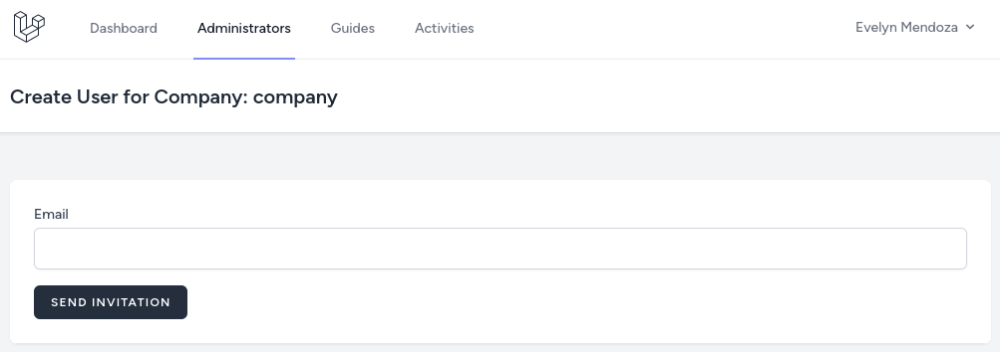
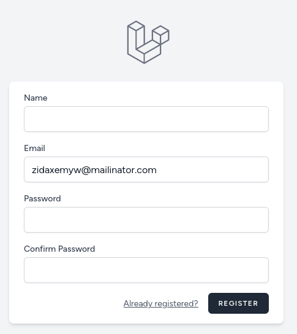

After making MVP in the last lessons, we sent the result for a client review. Here's one point of feedback they gave us:

> All works well, but why does creating users involve adding passwords for them **manually**? Do you want me to make those passwords and send them via email? It's unsafe. Please build the invitation system with randomized links so the company owners and guides can create their passwords themselves.

Good point. So... It seems like we did not discuss the user creation flow enough, so now we need to make changes (*the lesson below*) and discuss potential delays/costs with the client. Lesson learned for next time - discuss how **exactly** features should work in more detail upfront.

Here's the list of topics that we'll cover below:
- Sending an email to the invited user.
- Use the invitation link to register the user to the correct company and role.
- Rewriting old tests and writing new ones.

---

## Sending Invitation Mail

So, first, instead of creating the user right away, let's send an invitation email. They won't be the system users until they register with their password. 

So, we will create a separate Model called `UserInvitation` where we will keep the email, invitation token, company ID, and role ID.

```php
php artisan make:model UserInvitation -m
```

**database/migrations/xxxx_create_intivations_table.php**:
```php
public function up(): void
{
    Schema::create('user_invitations', function (Blueprint $table) {
        $table->increments('id');
        $table->string('email')->unique();
        $table->string('token', 36)->unique()->nullable();
        $table->timestamp('registered_at')->nullable();
        $table->foreignId('company_id')->constrained()->cascadeOnDelete();
        $table->foreignId('role_id')->constrained()->cascadeOnDelete();
        $table->timestamps();
    });
}
```

**app/Models/UserInvitation.php**:
```php
class UserInvitation extends Model
{
    protected $fillable = [
        'email',
        'token',
        'registered_at',
        'company_id',
        'role_id',
    ];
}
```

Next, we must change the form for `Company Owner` and `Guides` CRUD. We won't need the name and passwords.

**resources/views/companies/users/create.blade.php**:
```blade
//
@csrf

<div> {{-- [tl! remove:start] }}
    <x-input-label for="name" value="Name" />
    <x-text-input id="name" name="name" value="{{ old('name') }}" type="text" class="block mt-1 w-full" />
    <x-input-error :messages="$errors->get('name')" class="mt-2" />
</div>

<div class="mt-4"> {{-- [tl! remove:end] }}
<div>  {{-- [tl! ++] }}
    <x-input-label for="email" value="Email" />
    <x-text-input id="email" name="email" value="{{ old('email') }}" type="text" class="block mt-1 w-full" />
    <x-input-error :messages="$errors->get('email')" class="mt-2" />
</div>

<div class="mt-4"> {{-- [tl! remove:start] }}
    <x-input-label for="password" value="Password" />
    <x-text-input id="password" name="password" value="{{ old('password') }}" type="password" class="block mt-1 w-full" />
    <x-input-error :messages="$errors->get('password')" class="mt-2" />
</div> {{-- [tl! remove:end] }}

<div class="mt-4">
    <x-primary-button>
        Save {{-- [tl! --] }}
        Send Invitation {{-- [tl! ++] }}
    </x-primary-button>
</div>
//
```

**resources/views/companies/guides/create.blade.php**:
```blade
//
@csrf

<div> {{-- [tl! remove:start] }}
    <x-input-label for="name" value="Name" />
    <x-text-input id="name" name="name" value="{{ old('name') }}" type="text" class="block mt-1 w-full" />
    <x-input-error :messages="$errors->get('name')" class="mt-2" />
</div>

<div class="mt-4"> {{-- [tl! remove:end] }}
<div>  {{-- [tl! ++] }}
    <x-input-label for="email" value="Email" />
    <x-text-input id="email" name="email" value="{{ old('email') }}" type="text" class="block mt-1 w-full" />
    <x-input-error :messages="$errors->get('email')" class="mt-2" />
</div>

<div class="mt-4"> {{-- [tl! remove:start] }}
    <x-input-label for="password" value="Password" />
    <x-text-input id="password" name="password" value="{{ old('password') }}" type="password" class="block mt-1 w-full" />
    <x-input-error :messages="$errors->get('password')" class="mt-2" />
</div> {{-- [tl! remove:end] }}

<div class="mt-4">
    <x-primary-button>
        Save {{-- [tl! --] }}
        Send Invitation {{-- [tl! ++] }}
    </x-primary-button>
</div>
//
```

**resources/views/companies/users/edit.blade.php**:
```blade
//
@csrf

<div> {{-- [tl! remove:start] }}
    <x-input-label for="name" value="Name" />
    <x-text-input id="name" name="name" value="{{ old('name') }}" type="text" class="block mt-1 w-full" />
    <x-input-error :messages="$errors->get('name')" class="mt-2" />
</div>

<div class="mt-4"> {{-- [tl! remove:end] }}
<div>  {{-- [tl! ++] }}
    <x-input-label for="email" value="Email" />
    <x-text-input id="email" name="email" value="{{ old('email') }}" type="text" class="block mt-1 w-full" />
    <x-input-error :messages="$errors->get('email')" class="mt-2" />
</div>

<div class="mt-4"> {{-- [tl! remove:start] }}
    <x-input-label for="password" value="Password" />
    <x-text-input id="password" name="password" value="{{ old('password') }}" type="password" class="block mt-1 w-full" />
    <x-input-error :messages="$errors->get('password')" class="mt-2" />
</div> {{-- [tl! remove:end] }}

<div class="mt-4">
    <x-primary-button>
        Save {{-- [tl! --] }}
        Send Invitation {{-- [tl! ++] }}
    </x-primary-button>
</div>
//
```

**resources/views/companies/guides/edit.blade.php**:
```blade
//
@csrf

<div> {{-- [tl! remove:start] }}
    <x-input-label for="name" value="Name" />
    <x-text-input id="name" name="name" value="{{ old('name') }}" type="text" class="block mt-1 w-full" />
    <x-input-error :messages="$errors->get('name')" class="mt-2" />
</div>

<div class="mt-4"> {{-- [tl! remove:end] }}
<div>  {{-- [tl! ++] }}
    <x-input-label for="email" value="Email" />
    <x-text-input id="email" name="email" value="{{ old('email') }}" type="text" class="block mt-1 w-full" />
    <x-input-error :messages="$errors->get('email')" class="mt-2" />
</div>

<div class="mt-4"> {{-- [tl! remove:start] }}
    <x-input-label for="password" value="Password" />
    <x-text-input id="password" name="password" value="{{ old('password') }}" type="password" class="block mt-1 w-full" />
    <x-input-error :messages="$errors->get('password')" class="mt-2" />
</div> {{-- [tl! remove:end] }}

<div class="mt-4">
    <x-primary-button>
        Save {{-- [tl! --] }}
        Send Invitation {{-- [tl! ++] }}
    </x-primary-button>
</div>
//
```



Also, it means we need only the email in the Form Request. The email must also check uniqueness in the `user_invitations` table instead of the `users` table. And we will change the validation message.

**app/Http/Requests/StoreUserRequest.php**:
```php
class StoreGuideRequest extends FormRequest
{
    // ...

    public function rules(): array
    {
        return [
            'name' => ['required', 'string'], // [tl! remove:start]
            'email' => ['required', 'email', 'unique:users,email'],
            'password' => ['required', Rules\Password::defaults()], // [tl! remove:end]
            'email' => ['required', 'email', 'unique:user_invitations,email'], // [tl! ++]
        ];
    }

    public function messages(): array // [tl! add:start]
    {
        return [
            'email.unique' => 'Invitation with this email address already requested.'
        ];
    } // [tl! add:end]
}
```

**app/Http/Requests/StoreGuideRequest.php**:
```php
class StoreGuideRequest extends FormRequest
{
    // ...

    public function rules(): array
    {
        return [
            'name' => ['required', 'string'], // [tl! remove:start]
            'email' => ['required', 'email', 'unique:users,email'],
            'password' => ['required', Rules\Password::defaults()], // [tl! remove:end]
            'email' => ['required', 'email', 'unique:user_invitations,email'], // [tl! ++]
        ];
    }

    public function messages(): array // [tl! add:start]
    {
        return [
            'email.unique' => 'Invitation with this email address already requested.'
        ];
    } // [tl! add:end]
}
```

Now, we need to create the [Mail](https://laravel.com/docs/mail).

```sh
php artisan make:mail RegistrationInvite --markdown=emails.invitation
```

The Mail will accept the invitation, which we will create in the Controller later before sending the Mail. And to the markdown, we need to pass the invitation URL.

**app/Mail/RegistrationInvite.php**:

```php
use App\Models\UserInvitation;

class RegistrationInvite extends Mailable
{
    use Queueable, SerializesModels;

    public function __construct(private readonly UserInvitation $invitation)
    {}

    public function envelope(): Envelope
    {
        return new Envelope(
            subject: 'Invitation',
        );
    }

    public function content(): Content
    {
        return new Content(
            markdown: 'emails.invitation',
            with: [
                'inviteUrl' => urldecode(route('register') . '?invitation_token=' . $this->invitation->token),
            ]
        );
    }
}
```

And the Mail message can look like this.

```blade
<x-mail::message>
# You Have Been Invited

You have been invited to the {{ config('app.name') }}

<x-mail::button :url="$inviteUrl">
Register
</x-mail::button>

Thanks,<br>
{{ config('app.name') }}
</x-mail::message>
```

Next, in the Controller, instead of creating a user, we send the invitation.

**app/Http/Controllers/CompanyUserController.php**:

```php
use App\Models\UserInvitation;
use Illuminate\Support\Str;
use App\Mail\UserRegistrationInvite;
use Illuminate\Support\Facades\Mail;

class CompanyUserController extends Controller
{
    // ...

    public function store(StoreUserRequest $request, Company $company)
    {
        $this->authorize('create', $company);

        $invitation = UserInvitation::create([
            'email' => $request->input('email'),
            'token' => Str::uuid(),
            'company_id' => $company->id,
            'role_id' => Role::COMPANY_OWNER->value,
        ]);

        Mail::to($request->input('email'))->send(new UserRegistrationInvite($invitation));

        return to_route('companies.users.index', $company);
    }

    // ...
}
```

**app/Http/Controllers/CompanyGuideController.php**:

```php
use App\Models\UserInvitation;
use Illuminate\Support\Str;
use App\Mail\UserRegistrationInvite;
use Illuminate\Support\Facades\Mail;

class CompanyGuideController extends Controller
{
    // ...

    public function store(StoreGuideRequest $request, Company $company)
    {
        $this->authorize('create', $company);

        $invitation = UserInvitation::create([
            'email' => $request->input('email'),
            'token' => Str::uuid(),
            'company_id' => $company->id,
            'role_id' => Role::GUIDE->value,
        ]);

        Mail::to($request->input('email'))->send(new UserRegistrationInvite($invitation));

        return to_route('companies.guides.index', $company);
    }

    // ...
}
```

And the invitation email is now sent.


---

## Registering User with Invitation

Now that users can receive the invitation email, we need to make the registration part work. This can be done in a couple of ways, like adding a hidden field with the token, but I chose to do it with [Session](https://laravel.com/docs/session).

First, in the `RegisteredUserController` of Laravel Breeze, let's put the token into a Session and auto-fill the email field.

**app/Http/Controllers/RegisteredUserController.php**:

```php
use App\Models\UserInvitation;

class RegisteredUserController extends Controller
{
    public function create(Request $request): View
    {
        $email = null;

        if ($request->has('invitation_token')) {
            $token = $request->input('invitation_token');

            session()->put('invitation_token', $token);

            $invitation = UserInvitation::where('token', $token)
                ->whereNull('registered_at')
                ->firstOrFail();

            $email = $invitation->email;
        }

        return view('auth.register', compact('email'));
    }

    // ...
}
```

**resources/views/auth/register.blade.php**:
```blade
// ...
<!-- Email Address -->
<div class="mt-4">
    <x-input-label for="email" :value="__('Email')" />
    <x-text-input id="email" class="block mt-1 w-full" type="email" name="email" :value="old('email')" required autocomplete="username" /> {{-- [tl! --] --}}
    <x-text-input id="email" class="block mt-1 w-full" type="email" name="email" :value="old('email', $email)" required autocomplete="username" /> {{-- [tl! ++] --}}
    <x-input-error :messages="$errors->get('email')" class="mt-2" />
</div>
// ...
```



All that's left is to check if the Session has the `invitation_token` key. If it does, get the invitation where the token and entered email match, and `registered_at` is null.

And then, when creating the user, set the correct `company_id` and `role_id`.

**app/Http/Controllers/RegisteredUserController.php**:
```php
use Illuminate\Validation\ValidationException;

class RegisteredUserController extends Controller
{
    // ...
    public function store(Request $request): RedirectResponse
    {
        $request->validate([
            'name' => ['required', 'string', 'max:255'],
            'email' => ['required', 'string', 'email', 'max:255', 'unique:'.User::class],
            'password' => ['required', 'confirmed', Rules\Password::defaults()],
        ]);

        if ($request->session()->get('invitation_token')) { // [tl! add:start]
            $invitation = UserInvitation::where('token', $request->session()->get('invitation_token'))
                ->where('email', $request->email)
                ->whereNull('registered_at')
                ->firstOr(fn() => throw ValidationException::withMessages(['invitation' => 'Invitation link does not match the email']));

            $role = $invitation->role_id;
            $company = $invitation->company_id;

            $invitation->update(['registered_at' => now()]);
        } // [tl! add:end]

        $user = User::create([
            'name' => $request->name,
            'email' => $request->email,
            'password' => Hash::make($request->password),
            'role_id' => Role::CUSTOMER->value, // [tl! --]
            'role_id' => $role ?? Role::CUSTOMER->value, // [tl! ++]
            'company_id' => $company ?? null, // [tl! ++]
        ]);

        event(new Registered($user));

        Auth::login($user);

        return redirect(RouteServiceProvider::HOME);
    }
}
```

If we don't find the invitation, we throw the Validation Exception. Let's show the validation message at the start of the registration form.

**resources/views/auth/register.blade.php**:
```blade
<x-guest-layout>
    <form method="POST" action="{{ route('register') }}">
        @csrf

        <x-input-error :messages="$errors->get('invitation')" class="mt-2" /> {{-- [tl! ++] --}}

// ...
```


---

## Tests

After changing the user creation logic, we must also change the tests and add a new one for the registration. But first, let's add a setting in the main `TestCase` that our Seeders would always be executed.

**tests/TestCase.php**:
```php
abstract class TestCase extends BaseTestCase
{
    use CreatesApplication;

    protected bool $seed = true; // [tl! ++]
}
```

Now for the tests. Instead of testing that user was created, we need to check that the invitation was created with the right `company_id` and `role_id` and that the Mail was sent.

We will create new tests in the `CompanyUserTest` instead of the old `test_admin_can_create_user_for_a_company` and `test_company_owner_can_create_user_to_his_company`.

**tests/Feature/CompanyUserTest.php**:

```php
use App\Mail\UserRegistrationInvite;
use Illuminate\Support\Facades\Mail;

class CompanyUserTest extends TestCase
{
    use RefreshDatabase;

    // ...

    public function test_admin_can_send_invite_to_user_for_a_company()
    {
        Mail::fake();

        $company = Company::factory()->create();
        $user = User::factory()->admin()->create();

        $response = $this->actingAs($user)->post(route('companies.users.store', $company->id), [
            'email' => 'test@test.com',
        ]);

        Mail::assertSent(UserRegistrationInvite::class);

        $response->assertRedirect(route('companies.users.index', $company->id));

        $this->assertDatabaseHas('user_invitations', [
            'email' => 'test@test.com',
            'registered_at' => null,
            'company_id' => $company->id,
            'role_id' => Role::COMPANY_OWNER->value,
        ]);
    }

    public function test_invitation_can_be_sent_only_once_for_user()
    {
        $company = Company::factory()->create();
        $user = User::factory()->admin()->create();

        $this->actingAs($user)->post(route('companies.users.store', $company->id), [
            'email' => 'test@test.com',
        ]);

        $response = $this->actingAs($user)->post(route('companies.users.store', $company->id), [
            'email' => 'test@test.com',
        ]);

        $response->assertInvalid(['email' => 'Invitation with this email address already requested.']);
    }

    // ...

    public function test_company_owner_can_send_invite_to_user()
    {
        Mail::fake();

        $company = Company::factory()->create();
        $user = User::factory()->admin()->create();

        $response = $this->actingAs($user)->post(route('companies.users.store', $company->id), [
            'email' => 'test@test.com',
        ]);

        Mail::assertSent(UserRegistrationInvite::class);

        $response->assertRedirect(route('companies.users.index', $company->id));

        $this->assertDatabaseHas('user_invitations', [
            'email' => 'test@test.com',
            'registered_at' => null,
            'company_id' => $company->id,
            'role_id' => Role::COMPANY_OWNER->value,
        ]);
    }

    // ...
}
```

The same goes for the `CompanyGuideTest` test, a new one instead of `test_company_owner_can_create_guide_to_his_company`.

**tests/Feature/CompanyGuideTest.php**:

```php
use App\Mail\UserRegistrationInvite;
use Illuminate\Support\Facades\Mail;

class CompanyGuideTest extends TestCase
{
    use RefreshDatabase;

    // ...

    public function test_company_owner_can_send_invite_to_guide_to_his_company()
    {
        Mail::fake();

        $company = Company::factory()->create();
        $user = User::factory()->admin()->create();

        $response = $this->actingAs($user)->post(route('companies.guides.store', $company->id), [
            'email' => 'test@test.com',
        ]);

        Mail::assertSent(UserRegistrationInvite::class);

        $response->assertRedirect(route('companies.guides.index', $company->id));

        $this->assertDatabaseHas('user_invitations', [
            'email' => 'test@test.com',
            'registered_at' => null,
            'company_id' => $company->id,
            'role_id' => Role::GUIDE->value,
        ]);
    }

    public function test_invitation_can_be_sent_only_once_for_user()
    {
        $company = Company::factory()->create();
        $user = User::factory()->companyOwner()->create(['company_id' => $company]);

        $this->actingAs($user)->post(route('companies.guides.store', $company->id), [
            'email' => 'test@test.com',
        ]);

        $response = $this->actingAs($user)->post(route('companies.guides.store', $company->id), [
            'email' => 'test@test.com',
        ]);

        $response->assertInvalid(['email' => 'Invitation with this email address already requested.']);
    }

    // ...
}
```

That's it for the invitation tests. Now let's add new tests for the registration. We will test that the user is registered with the right company and get the correct role.

**tests/Feature/Auth/RegistrationTest.php**:

```php
use App\Enums\Role;
use App\Models\User;
use App\Models\Company;
use App\Models\UserInvitation;
use Illuminate\Support\Facades\Auth;

class RegistrationTest extends TestCase
{
    // ...

    public function test_user_can_register_with_token_for_company_owner_role()
    {
        $company = Company::factory()->create();
        $user = User::factory()->companyOwner()->create(['company_id' => $company->id]);

        $this->actingAs($user)->post(route('companies.users.store', $company->id), [
            'email' => 'test@test.com',
        ]);

        $invitation = UserInvitation::where('email', 'test@test.com')->first();

        Auth::logout();

        $response = $this->withSession(['invitation_token' => $invitation->token])->post('/register', [
            'name' => 'Test User',
            'email' => 'test@test.com',
            'password' => 'password',
            'password_confirmation' => 'password',
        ]);

        $this->assertDatabaseHas('users', [
            'name' => 'Test User',
            'email' => 'test@test.com',
            'company_id' => $company->id,
            'role_id' => Role::COMPANY_OWNER->value,
        ]);

        $this->assertAuthenticated();

        $response->assertRedirect(RouteServiceProvider::HOME);
    }

    public function test_user_can_register_with_token_for_guide_role()
    {
        $company = Company::factory()->create();
        $user = User::factory()->companyOwner()->create(['company_id' => $company->id]);

        $this->actingAs($user)->post(route('companies.guides.store', $company->id), [
            'email' => 'test@test.com',
        ]);

        $invitation = UserInvitation::where('email', 'test@test.com')->first();

        Auth::logout();

        $response = $this->withSession(['invitation_token' => $invitation->token])->post('/register', [
            'name' => 'Test User',
            'email' => 'test@test.com',
            'password' => 'password',
            'password_confirmation' => 'password',
        ]);

        $this->assertDatabaseHas('users', [
            'name' => 'Test User',
            'email' => 'test@test.com',
            'company_id' => $company->id,
            'role_id' => Role::GUIDE->value,
        ]);

        $this->assertAuthenticated();

        $response->assertRedirect(RouteServiceProvider::HOME);
    }
}
```

Let's check all the tests. Great, they are all green!


