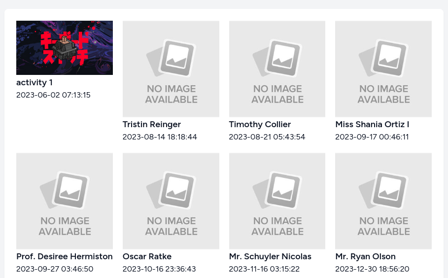
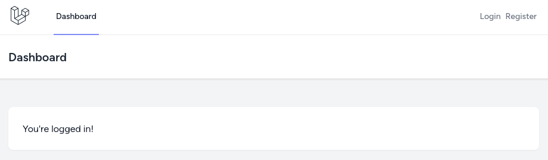
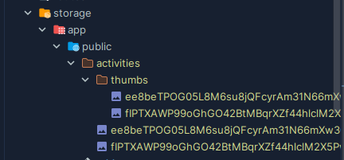
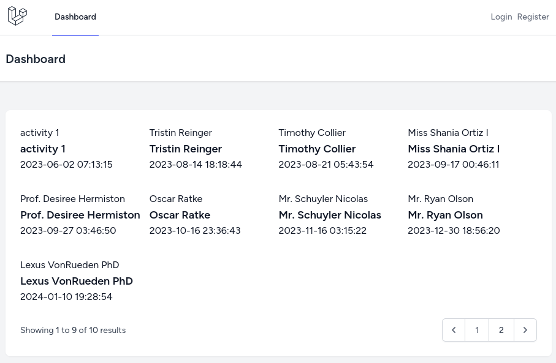
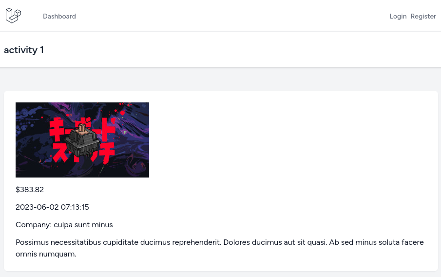
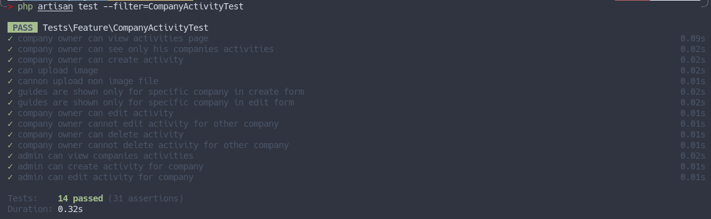
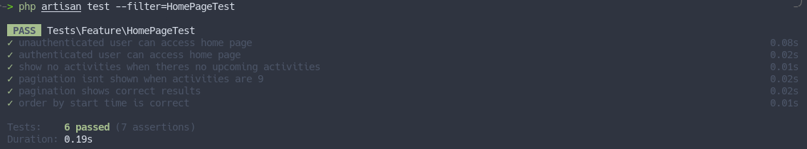

Ok, now our users can manage activities. Time to show them on the public front-facing website, starting with the homepage. 

Of course, in a real-life scenario, we would need a **visual design** here, but HTML/CSS things are outside this course's scope. We will stick to the default Laravel Breeze design and build a grid view here. As "homework", you can try to find and apply some Tailwind/Bootstrap theme instead or create a custom design.

This is what we'll build in this lesson:



Here's the list of topics that we'll cover below:
- Modifying Breeze layout for quickly building frontend features.
- Creating a thumbnail image for the activity.
- Showing activities on the homepage and showing the activity itself.
- Adding dummy data so the client can better see how the homepage will look.
- Writing tests.

---

## Modifying Breeze Layout

Before using Breeze Layout for the homepage, we must make it work for non-authenticated guest users. 

First, create a new [invokable](https://laravel.com/docs/10.x/controllers#single-action-controllers) `HomeController` and rename the `resources/views/dashboard.blade.php` into `resources/views/home.blade.php`.

```sh
php artisan make:controller HomeController --invokable
```

**app/Http/Controllers/HomeController.php**:
```php
class HomeController extends Controller
{
    public function __invoke()
    {
        return view('home');
    }
}
```

Next, we need to change the Routes to use `HomeController`.

**routes/web.php**:
```php
use App\Http\Controllers\HomeController;

Route::get('/', function () { // [tl! remove:start]
    return view('welcome');
});

Route::get('/dashboard', function () {
    return view('dashboard');
})->middleware(['auth', 'verified'])->name('dashboard'); // [tl! remove:end]
Route::get('/', HomeController::class)->name('home'); // [tl! ++]

// ...
```

Because we removed the `dashboard` route, we need to change the global setting of where to redirect after the login.

**app/Providers/RouteServiceProvider.php**:
```php
class RouteServiceProvider extends ServiceProvider
{
    public const HOME = '/dashboard'; // [tl! --]
    public const HOME = '/'; // [tl! ++]

    // ...
}
```

And in the navigation, besides changing the route name, we need to wrap links only for authenticated users with the `@auth` Blade directive.

**resources/views/layouts/navigation.blade.php**:
```blade
<nav x-data="{ open: false }" class="bg-white border-b border-gray-100">
    <!-- Primary Navigation Menu -->
    <div class="max-w-7xl mx-auto px-4 sm:px-6 lg:px-8">
        <div class="flex justify-between h-16">
            <div class="flex">
                <!-- Logo -->
                <div class="shrink-0 flex items-center">
                    <a href="{{ route('dashboard') }}"> {{-- [tl! --] --}}
                    <a href="{{ route('home') }}"> {{-- [tl! ++] --}}
                        <x-application-logo class="block h-9 w-auto fill-current text-gray-800" />
                    </a>
                </div>

                <!-- Navigation Links -->
                <div class="hidden space-x-8 sm:-my-px sm:ml-10 sm:flex">
                    <x-nav-link :href="route('home')" :active="request()->routeIs('home')">
                        {{ __('Dashboard') }}
                    </x-nav-link>
                    @auth {{-- [tl! ++] --}}
                        @if(auth()->user()->role_id === \App\Enums\Role::ADMINISTRATOR->value)
                            <x-nav-link :href="route('companies.index')" :active="request()->routeIs('companies.index')">
                                {{ __('Companies') }}
                            </x-nav-link>
                        @endif
                        @if(auth()->user()->role_id === \App\Enums\Role::COMPANY_OWNER->value)
                            <x-nav-link :href="route('companies.users.index', auth()->user()->company_id)" :active="request()->routeIs('companies.users.*')">
                                {{ __('Administrators') }}
                            </x-nav-link>
                            <x-nav-link :href="route('companies.guides.index', auth()->user()->company_id)" :active="request()->routeIs('companies.guides.*')">
                                {{ __('Guides') }}
                            </x-nav-link>
                            <x-nav-link :href="route('companies.activities.index', auth()->user()->company_id)" :active="request()->routeIs('companies.activities.*')">
                                {{ __('Activities') }}
                            </x-nav-link>
                        @endif
                    @endauth {{-- [tl! ++] --}}
                </div>
            </div>

            <!-- Settings Dropdown -->
            <div class="hidden sm:flex sm:items-center sm:ml-6">
                @auth {{-- [tl! ++] --}}
                    <x-dropdown align="right" width="48">
                        <x-slot name="trigger">
                            <button class="inline-flex items-center px-3 py-2 border border-transparent text-sm leading-4 font-medium rounded-md text-gray-500 bg-white hover:text-gray-700 focus:outline-none transition ease-in-out duration-150">
                                <div>{{ Auth::user()->name }}</div>

                                <div class="ml-1">
                                    <svg class="fill-current h-4 w-4" xmlns="http://www.w3.org/2000/svg" viewBox="0 0 20 20">
                                        <path fill-rule="evenodd" d="M5.293 7.293a1 1 0 011.414 0L10 10.586l3.293-3.293a1 1 0 111.414 1.414l-4 4a1 1 0 01-1.414 0l-4-4a1 1 0 010-1.414z" clip-rule="evenodd" />
                                    </svg>
                                </div>
                            </button>
                        </x-slot>

                        <x-slot name="content">
                            <x-dropdown-link :href="route('profile.edit')">
                                {{ __('Profile') }}
                            </x-dropdown-link>

                            <!-- Authentication -->
                            <form method="POST" action="{{ route('logout') }}">
                                @csrf

                                <x-dropdown-link :href="route('logout')"
                                        onclick="event.preventDefault();
                                                    this.closest('form').submit();">
                                    {{ __('Log Out') }}
                                </x-dropdown-link>
                            </form>
                        </x-slot>
                    </x-dropdown>
                @else {{-- [tl! add:start] --}}
                    <x-nav-link :href="route('login')" :active="request()->routeIs('login')">
                        {{ __('Login') }}
                    </x-nav-link>
                    <x-nav-link :href="route('register')" :active="request()->routeIs('register')">
                        {{ __('Register') }}
                    </x-nav-link>
                @endauth {{-- [tl! add:end] --}}
            </div>

            <!-- Hamburger -->
            <div class="-mr-2 flex items-center sm:hidden">
                <button @click="open = ! open" class="inline-flex items-center justify-center p-2 rounded-md text-gray-400 hover:text-gray-500 hover:bg-gray-100 focus:outline-none focus:bg-gray-100 focus:text-gray-500 transition duration-150 ease-in-out">
                    <svg class="h-6 w-6" stroke="currentColor" fill="none" viewBox="0 0 24 24">
                        <path :class="{'hidden': open, 'inline-flex': ! open }" class="inline-flex" stroke-linecap="round" stroke-linejoin="round" stroke-width="2" d="M4 6h16M4 12h16M4 18h16" />
                        <path :class="{'hidden': ! open, 'inline-flex': open }" class="hidden" stroke-linecap="round" stroke-linejoin="round" stroke-width="2" d="M6 18L18 6M6 6l12 12" />
                    </svg>
                </button>
            </div>
        </div>
    </div>

    <!-- Responsive Navigation Menu -->
    <div :class="{'block': open, 'hidden': ! open}" class="hidden sm:hidden">
        <div class="pt-2 pb-3 space-y-1">
            <x-responsive-nav-link :href="route('dashboard')" :active="request()->routeIs('dashboard')"> {{-- [tl! --] --}}
            <x-responsive-nav-link :href="route('home')" :active="request()->routeIs('home')"> {{-- [tl! ++] --}}
                {{ __('Dashboard') }}
            </x-responsive-nav-link>
        </div>

        <!-- Responsive Settings Options -->
        @auth {{-- [tl! ++] --}}
            <div class="pt-4 pb-1 border-t border-gray-200">
                <div class="px-4">
                    <div class="font-medium text-base text-gray-800">{{ Auth::user()->name }}</div>
                    <div class="font-medium text-sm text-gray-500">{{ Auth::user()->email }}</div>
                </div>

                <div class="mt-3 space-y-1">
                    <x-responsive-nav-link :href="route('profile.edit')">
                        {{ __('Profile') }}
                    </x-responsive-nav-link>

                    <!-- Authentication -->
                    <form method="POST" action="{{ route('logout') }}">
                        @csrf

                        <x-responsive-nav-link :href="route('logout')"
                                onclick="event.preventDefault();
                                            this.closest('form').submit();">
                            {{ __('Log Out') }}
                        </x-responsive-nav-link>
                    </form>
                </div>
            </div>
        @endauth {{-- [tl! --] --}}
    </div>
</nav>
```



---

## Making Thumbnail for Activity

Every activity should have a thumbnail to be shown on the homepage.

We will use the `intervention/image` package to make a thumbnail. Yes, we could use `spatie/laravel-medialibrary,` but I think it would be overkill for only one image per activity for such a small project, at least for now.

```sh
composer require intervention/image
```

Because making thumbnail needs to be done both when creating and editing the activity, we can create a separate private method to avoid repeating the code. 

So the Controller changes would be:

**app/Http/Controllers/CompanyActivityController.php**:
```php
use Intervention\Image\Facades\Image;

class CompanyActivityController extends Controller
{
    // ...

    public function store(StoreActivityRequest $request, Company $company)
    {
        $this->authorize('create', $company);

        if ($request->hasFile('image')) { // [tl! remove:start]
            $path = $request->file('image')->store('activities', 'public');
        } // [tl! remove:end]
        $filename = $this->uploadImage($request); // [tl! ++]

        $activity = Activity::create($request->validated() + [
            'company_id' => $company->id,
            'photo' => $path ?? null, // [tl! --]
            'photo' => $filename, // [tl! ++]
        ]);

        $activity->participants()->sync($request->input('guides'));

        return to_route('companies.activities.index', $company);
    }

    // ...

    public function update(UpdateActivityRequest $request, Company $company, Activity $activity)
    {
        $this->authorize('update', $company);

        if ($request->hasFile('image')) { // [tl! remove:start]
            $path = $request->file('image')->store('activities', 'public');
            if ($activity->photo) {
                Storage::disk('public')->delete($activity->photo);
            }
        } // [tl! remove:end]
        $filename = $this->uploadImage($request); // [tl! ++]

        $activity->update($request->validated() + [
            'photo' => $path ?? $activity->photo, // [tl! --]
            'photo' => $filename ?? $activity->photo, // [tl! ++]
        ]);

        return to_route('companies.activities.index', $company);
    }

    // ...

    private function uploadImage(StoreActivityRequest|UpdateActivityRequest $request): string|null // [tl! add:start]
    {
        if (! $request->hasFile('image')) {
            return null;
        }

        $filename = $request->file('image')->store(options: 'activities');

        $img = Image::make(Storage::disk('activities')->get($filename))
            ->resize(274, 274, function ($constraint) {
                $constraint->aspectRatio();
            });

        Storage::disk('activities')->put('thumbs/' . $request->file('image')->hashName(), $img->stream());

        return $filename;
    } // [tl! add:end]
}
```

As you can see, we are using a disk called `activities` for file upload. We need to add this custom disk to the `config/filesystems.php`.

**config/filesystems.php**:
```php
return [
    // ...
    'disks' => [

        // ...

        'activities' => [
            'driver' => 'local',
            'root' => storage_path('app/public/activities'),
            'url' => env('APP_URL').'/storage',
            'visibility' => 'public',
        ],

        // ...

    ],
    // ...
];
```

Next, we must delete the image when a new one is uploaded to the edit page. I think [Observer](https://laravel.com/docs/eloquent#observers) would be a perfect fit.

```sh
php artisan make:observer ActivityObserver
```

**app/Providers/EventServiceProvider.php**:
```php
use App\Models\Activity;
use App\Observers\ActivityObserver;

class EventServiceProvider extends ServiceProvider
{
    // ...

    public function boot(): void
    {
        Activity::observe(ActivityObserver::class);
    }

    // ...
}
```

After uploading images, we also have thumbnail images in the `activites/thumbs` directory.



---

## Showing Activities on the Homepage

Now we can show activities on the homepage by paginating them and showing `No activities` if there are none. 

On the homepage, we will show upcoming activities and order them by `start_time` in a simple 3x3 grid layout, 9 records per page.

**app/Http/Controllers/HomeController.php**:
```php
use App\Models\Activity;

class HomeController extends Controller
{
    public function __invoke()
    {
        $activities = Activity::where('start_time', '>', now())
            ->orderBy('start_time')
            ->paginate(9);

        return view('home', compact('activities'));
    }
}
```

**resources/views/home.blade.php**:
```blade
<x-app-layout>
    <x-slot name="header">
        <h2 class="text-xl font-semibold leading-tight text-gray-800">
            {{ __('Dashboard') }}
        </h2>
    </x-slot>

    <div class="py-12">
        <div class="mx-auto max-w-7xl sm:px-6 lg:px-8">
            <div class="overflow-hidden bg-white shadow-sm sm:rounded-lg">
                <div class="p-6 text-gray-900">
                    <div class="grid grid-cols-4 gap-x-5 gap-y-8">
                        @forelse($activities as $activity)
                            <div>
                                thumbnail) }}" alt="{{ $activity->name }}">
                                <h2>
                                    <a href="#" class="text-lg font-semibold">{{ $activity->name }}</a>
                                </h2>
                                <time>{{ $activity->start_time }}</time>
                            </div>
                        @empty
                            <p>No activities</p>
                        @endforelse
                    </div>

                    <div class="mt-6">{{ $activities->links() }}</div>
                </div>
            </div>
        </div>
    </div>
</x-app-layout>
```

This is what we will see:



In the Blade file, I used `thumbnail` for showing thumbnails, but we don't have such a field in the DB. To display the thumbnail, we will use [Accessor](https://laravel.com/docs/eloquent-mutators#defining-an-accessor). Also, if there is no image for the activity, we will show a default image I took from the first Google result.

**app/Models/Activity.php**:
```php
use Illuminate\Database\Eloquent\Casts\Attribute;

class Activity extends Model
{
    // ...

    public function thumbnail(): Attribute
    {
        return Attribute::make(
            get: fn() => $this->photo ? '/activities/thumbs/' . $this->photo : '/no_image.jpg',
        );
    }
}
```

Now it is showing a thumbnail image or the default `no_image.jpg`.


---

## Show Activity

Now that we have the list of activities, we can make images and titles clickable to show the detail page for the activity. But first, we need a Controller and Route.

```sh
php artisan make:controller ActivityController
```

**routes/web.php**:
```php
use App\Http\Controllers\ActivityController;

Route::get('/', HomeController::class)->name('home');
Route::get('/activities/{activity}', [ActivityController::class, 'show'])->name('activity.show'); // [tl! ++]

// ...
```

For the Route, I am using [Route Model Binding](https://laravel.com/docs/routing#route-model-binding), meaning we can return a View and pass the activity to it in the Controller.

**app/Http/Controllers/ActivityController.php**:
```php
use App\Models\Activity;

class ActivityController extends Controller
{
    public function show(Activity $activity)
    {
        return view('activities.show', compact('activity'));
    }
}
```

And in the Blade file, we just show all the information for now.

**resources/views/activities/show.blade.php**:
```blade
<x-app-layout>
    <x-slot name="header">
        <h2 class="text-xl font-semibold leading-tight text-gray-800">
            {{ $activity->name }}
        </h2>
    </x-slot>

    <div class="py-12">
        <div class="mx-auto max-w-7xl sm:px-6 lg:px-8">
            <div class="overflow-hidden bg-white shadow-sm sm:rounded-lg">
                <div class="p-6 text-gray-900 space-y-3">
                    thumbnail) }}" alt="{{ $activity->name }}">
                    <div>${{ $activity->price }}</div>
                    <time>{{ $activity->start_time }}</time>
                    <div>Company: {{ $activity->company->name }}</div>
                    <p>{{ $activity->description }}</p>
                </div>
            </div>
        </div>
    </div>
</x-app-layout>
```

All that is left is to add a link to the homepage.

**resources/views/home.blade.php**:
```blade
// ...
<div class="grid grid-cols-4 gap-5">
    @forelse($activities as $activity)
        <div>
            <a href="{{ route('activity.show', $activity) }}"> {{-- [tl! ++] --}}
                thumbnail) }}" alt="{{ $activity->name }}">
            </a> {{-- [tl! ++] --}}
            <h2>
                <a href="#" class="text-lg font-semibold">{{ $activity->name }}</a> {{-- [tl! --] --}}
                <a href="{{ route('activity.show', $activity) }}" class="text-lg font-semibold">{{ $activity->name }}</a> {{-- [tl! ++] --}}
            </h2>
            <time>{{ $activity->start_time }}</time>
        </div>
    @empty
        <p>No activities</p>
    @endforelse
</div>

// ...
```

Now, after visiting an activity, we should see a similar result:



---

## Seeding Dummy Data

We need to add some "fake" data to show this homepage to the client. Of course, it will be a [Seeder](https://laravel.com/docs/seeding#writing-seeders).

```sh
php artisan make:seeder ActivitySeeder
```

**database/seeders/ActivitySeeder.php**:
```php
class ActivitySeeder extends Seeder
{
    public function run(): void
    {
        Activity::factory(20)->create();
    }
}
```

And we need to call it.

**database/seeders/DatabaseSeeder.php**:
```php
class DatabaseSeeder extends Seeder
{
    public function run(): void
    {
        $this->call([
            RoleSeeder::class,
            ActivitySeeder::class, // [tl! ++]
        ]);
    }
}
```

---

## Tests

Before adding tests for the homepage, we need to fix the seeding process. In the `TestCase`, we added a `$seed` variable to run the main Seeder, but we don't need to seed activities every time. However, we can change it to seed only the roles.

**tests/TestCase.php**:
```php
use Database\Seeders\RoleSeeder;

abstract class TestCase extends BaseTestCase
{
    use CreatesApplication;

    protected bool $seed = true; // [tl! --]
    protected string $seeder = RoleSeeder::class; // [tl! ++]
}
```

First, let's add one more assertion for the image upload test. We added a feature to create a thumbnail, so let's check if a thumbnail has been created. Also, let's change the disk from `public` to `activities`.

**tests/Feature/CompanyActivityTest.php**:
```php
use Tests\TestCase;
use App\Models\User;
use App\Models\Company;
use App\Models\Activity;
use Illuminate\Http\UploadedFile;
use Illuminate\Support\Collection;
use Illuminate\Support\Facades\Storage;
use Illuminate\Foundation\Testing\RefreshDatabase;

class CompanyActivityTest extends TestCase
{
    // ...

    public function test_can_upload_image()
    {
        Storage::fake('activities');

        $company = Company::factory()->create();
        $user = User::factory()->companyOwner()->create(['company_id' => $company->id]);
        $guide = User::factory()->guide()->create();

        $file = UploadedFile::fake()->image('avatar.jpg');

        $this->actingAs($user)->post(route('companies.activities.store', $company), [
            'name' => 'activity',
            'description' => 'description',
            'start_time' => '2023-09-01 10:00',
            'price' => 9999,
            'guides' => $guide->id,
            'image' => $file,
        ]);

        Storage::disk('public')->assertExists('activities/' . $file->hashName()); // [tl! --]
        Storage::disk('activities')->assertExists($file->hashName()); // [tl! ++]
        Storage::disk('activities')->assertExists('thumbs/' . $file->hashName()); // [tl! ++]
    }

    public function test_cannon_upload_non_image_file()
    {
        Storage::fake('activities');

        $company = Company::factory()->create();
        $user = User::factory()->companyOwner()->create(['company_id' => $company->id]);
        $guide = User::factory()->guide()->create();

        $file = UploadedFile::fake()->create('document.pdf', 2000, 'application/pdf');

        $response = $this->actingAs($user)->post(route('companies.activities.store', $company), [
            'name' => 'activity',
            'description' => 'description',
            'start_time' => '2023-09-01 10:00',
            'price' => 9999,
            'guides' => $guide->id,
            'image' => $file,
        ]);

        $response->assertSessionHasErrors(['image']);

        Storage::disk('public')->assertMissing('activities/' . $file->hashName()); // [tl! --]
        Storage::disk('activities')->assertMissing($file->hashName()); // [tl! ++]
    }

    // ...
}
```



Now let's test the homepage:
- Page can be accessed for both guests and authenticated users.
- If there are no activities message `No activities` is shown.
- When there aren't enough activities pagination link isn't shown.
- On the second page, the correct activity is shown.
- And activities are shown in the correct order.

```sh
php artisan make:test HomePageTest
```

**tests/Feature/HomePageTest.php**:
```php
use Tests\TestCase;
use App\Models\User;
use App\Models\Activity;
use Illuminate\Foundation\Testing\RefreshDatabase;

class HomePageTest extends TestCase
{
    use RefreshDatabase;

    public function test_unauthenticated_user_can_access_home_page()
    {
        $response = $this->get(route('home'));

        $response->assertOk();
    }

    public function test_authenticated_user_can_access_home_page()
    {
        $user = User::factory()->create();

        $response = $this->actingAs($user)->get(route('home'));

        $response->assertOk();
    }

    public function test_show_no_activities_when_theres_no_upcoming_activities()
    {
        $response = $this->get(route('home'));

        $response->assertSeeText('No activities');
    }

    public function test_pagination_isnt_shown_when_activities_are_9()
    {
        Activity::factory(9)->create();

        $response = $this->get(route('home'));

        $response->assertDontSee('Next');
    }

    public function test_pagination_shows_correct_results()
    {
        Activity::factory(9)->create();
        $activity = Activity::factory()->create(['start_time' => now()->addYear()]);

        $response = $this->get(route('home'));

        $response->assertSee('Next');

        $response = $this->get(route('home') . '/?page=2');
        $response->assertSee($activity->name);
    }

    public function test_order_by_start_time_is_correct()
    {
        $activity = Activity::factory()->create(['start_time' => now()->addWeek()]);
        $activity2 = Activity::factory()->create(['start_time' => now()->addMonth()]);
        $activity3 = Activity::factory()->create(['start_time' => now()->addMonths(2)]);

        $response = $this->get(route('home'));

        $response->assertSeeTextInOrder([
            $activity->name,
            $activity2->name,
            $activity3->name,
        ]);
    }
}
```



And another test for the activity show. For now, we will just test that page return status `200` if activity exists and  `404` if it doesn't exist.

```sh
php artisan make:test ActivityShowTest
```

**tests/Feature/ActivityTest.php**:
```php
use Tests\TestCase;
use App\Models\Activity;
use Illuminate\Foundation\Testing\RefreshDatabase;

class ActivityShowTest extends TestCase
{
    use RefreshDatabase;

    public function test_can_view_activity_page()
    {
        $activity = Activity::factory()->create();

        $response = $this->get(route('activity.show', $activity));

        $response->assertOk();
    }

    public function test_gets_404_for_unexisting_activity()
    {
        $response = $this->get(route('activity.show', 69));

        $response->assertNotFound();
    }
}
```


