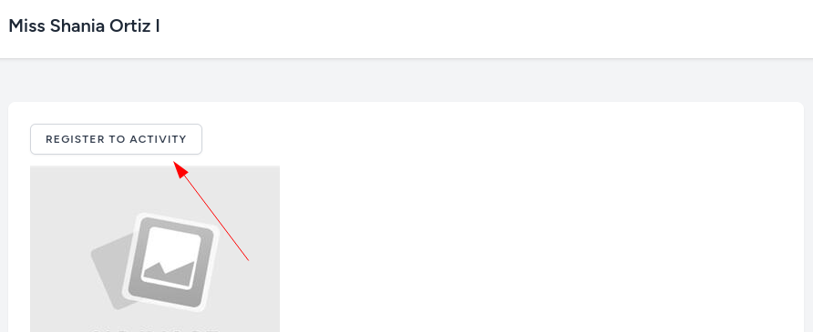
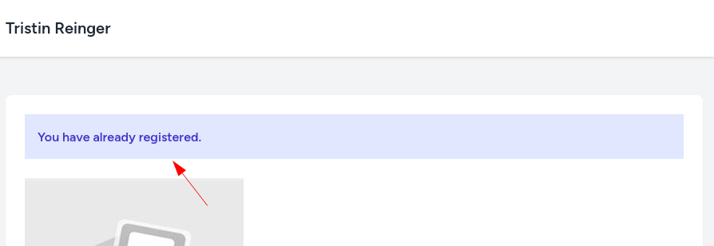
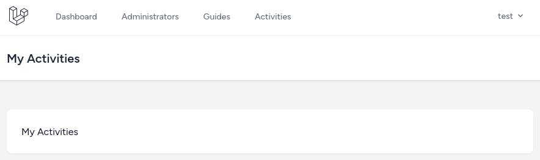
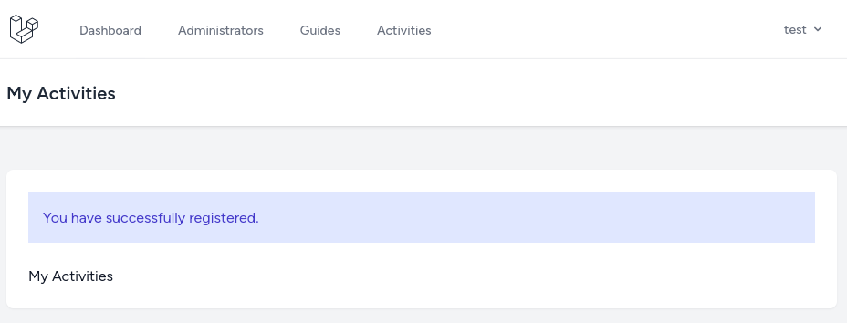
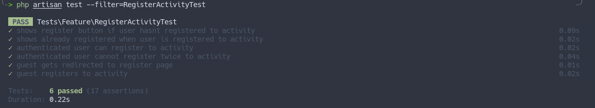

Now that we show activities, we need a button to allow the user to register for an activity. If the user is a guest, he will first be redirected to the registration page and, after registration, will be registered to the activity. Then, after successful registration for the activity, user will be redirected to the `My Activities` page and will receive an email.

---

## Registering Authenticated User to the Activity

The `Register to activity` button will make a `POST` request. So, first, let's add this button to the show activities page above the thumbnail image.

**resources/views/activities/show.blade.php**:
```php
// ...
<div class="p-6 text-gray-900 space-y-3">
    @if(auth()->user()?->activities->contains($activity)) {{-- [tl! add:start] --}}
        <div class="mb-6 bg-indigo-100 p-4 font-semibold text-indigo-700">You have already registered.</div>
    @else
        <form action="{{ route('activities.register', $activity) }}" method="POST">
            @csrf

            <x-secondary-button type="submit">
                Register to Activity
            </x-secondary-button>
        </form>
    @endif {{-- [tl! add:end] --}}

    thumbnail) }}" alt="{{ $activity->name }}">
    <div>${{ $activity->price }}</div>
    <time>{{ $activity->start_time }}</time>
    <div>Company: {{ $activity->company->name }}</div>
    <p>{{ $activity->description }}</p>
</div>
// ...
</x-app-layout>
```

As you can see here, I also added an if-statement: we won't show a button if the user is already registered for the activity. But for this to work, we must add an `activities` relation to the `User` Model.

**app/Models/User.php**:
```php
use Illuminate\Database\Eloquent\Relations\BelongsToMany;

class User extends Authenticatable
{
    // ...

    public function activities(): BelongsToMany
    {
        return $this->belongsToMany(Activity::class)->withTimestamps();
    }
}
```

When the user isn't registered for the activity, the expected result looks like this:



Otherwise, if the user is already registered, the expected result will look like this:



Next, we need a Controller and a Route.

```sh
php artisan make:controller ActivityRegisterController
```

**routes/web.php**:
```php
use App\Http\Controllers\ActivityRegisterController;

Route::get('/', HomeController::class)->name('home');
Route::get('/activities/{activity}', [ActivityController::class, 'show'])->name('activity.show');
Route::post('/activities/{activity}/register', [ActivityRegisterController::class, 'store'])->name('activities.register');

// ...
```

In the Controller, we need to perform a couple of things:

- If the user is a guest, redirect to the `register` route with the `activity` as a `GET` parameter.
- Abort the action if the authenticated user tries to register more than once.
- Attach activity for the user.
- Send a Notification to the user.
- And redirect to the `My activities` page with the success message.

**app/Http/Controllers/ActivityRegisterController.php**:
```php
use App\Models\Activity;
use Symfony\Component\HttpFoundation\Response;

class ActivityRegisterController extends Controller
{
    public function store(Activity $activity)
    {
        if (! auth()->check()) {
            return to_route('register', ['activity' => $activity->id]);
        }

        abort_if(auth()->user()->activities()->where('id', $activity->id)->exists(), Response::HTTP_CONFLICT);

        auth()->user()->activities()->attach($activity->id);

        return to_route('my-activity.show')->with('success', 'You have successfully registered.');
    }
}
```

Let's quickly create a `My activities` page (*blank for now*) so that redirect would work.

```sh
php artisan make:controller MyActivityController
```

**routes/web.php**:
```php
use App\Http\Controllers\MyActivityController;

// ...

Route::middleware('auth')->group(function () {
    Route::get('/activities', [MyActivityController::class, 'show'])->name('my-activity.show');

    // ...
});
```

**app/Http/Controllers/MyActivityController.php**:
```php
class MyActivityController extends Controller
{
    public function show()
    {
        return view('activities.my-activities');
    }
}
```

**resources/views/activities/my-activities.blade.php**:
```blade
<x-app-layout>
    <x-slot name="header">
        <h2 class="text-xl font-semibold leading-tight text-gray-800">
            {{ __('My Activities') }}
        </h2>
    </x-slot>

    <div class="py-12">
        <div class="mx-auto max-w-7xl sm:px-6 lg:px-8">
            <div class="overflow-hidden bg-white shadow-sm sm:rounded-lg">
                <div class="p-6 text-gray-900">
                    @if(session('success'))
                        <div class="mb-6 bg-indigo-100 p-4 text-indigo-700">{{ session('success') }}</div>
                    @endif

                    My Activities
                </div>
            </div>
        </div>
    </div>
</x-app-layout>
```

For now, it will only show the text `My Activities`, and will show the success message if it exists.



Now let's get back to registering user to the activity, and let's create a Notification and send it.

```sh
php artisan make:notification RegisteredToActivityNotification
```

**app/Notifications/RegisteredToActivityNotification**:
```php
use App\Models\Activity;
use Illuminate\Notifications\Notification;
use Illuminate\Notifications\Messages\MailMessage;

class RegisteredToActivityNotification extends Notification
{
    public function __construct(private readonly Activity $activity)
    {}

    public function via($notifiable): array
    {
        return ['mail'];
    }

    public function toMail($notifiable): MailMessage
    {
        return (new MailMessage)
            ->subject('You have successfully registered')
            ->line('Thank you for registering to the activity ' . $this->activity->name)
            ->line('Start time ' . $this->activity->start_time);
    }

    public function toArray($notifiable): array
    {
        return [];
    }
}
```

**app/Http/Controllers/ActivityRegisterController**:
```php
use App\Notifications\RegisteredToActivityNotification;

class ActivityRegisterController extends Controller
{
    public function store(Activity $activity)
    {
        if (! auth()->check()) {
            return to_route('register', ['activity' => $activity->id]);
        }

        abort_if(auth()->user()->activities()->where('id', $activity->id)->exists(), Response::HTTP_CONFLICT);

        auth()->user()->activities()->attach($activity->id);

        auth()->user()->notify(new RegisteredToActivityNotification($activity)); // [tl! ++]

        return to_route('my-activity.show')->with('success', 'You have successfully registered.');
    }
}
```

The mail message looks like this:


---

## Registering Guest to the Activity

Now that authenticated users can register for the activity, let's implement registration for **guests**. 

We have already made the redirect to the `register` page. I think we can use Sessions again to automatically register to the activity as we did with the invitations.

First, we need to set the session.

**app/Http/Controllers/Auth/RegisteredUserController.php**:
```php
class RegisteredUserController extends Controller
{
    public function create(Request $request): View
    {
        // ...

        if ($request->has('activity')) { // [tl! add:start]
            session()->put('activity', $request->input('activity'));
        } // [tl! add:end]

        return view('auth.register', compact('email'));
    }
    
    // ...
}
```

And then, after the submit button is clicked, we need to:
- Get the activity and check if the session is set.
- Attach activity to the just registered user.
- Send a Notification to the user.
- Redirect to the `My activities` route with the success message.

**app/Http/Controllers/Auth/RegisteredUserController.php**:
```php
use App\Models\Activity;
use App\Notifications\RegisteredToActivityNotification;

class RegisteredUserController extends Controller
{
    // ...
    
    public function store(Request $request): RedirectResponse
    {
        // ...

        $activity = Activity::find($request->session()->get('activity')); // [tl! add:start]
        if ($request->session()->get('activity') && $activity) {
            $user->activities()->attach($request->session()->get('activity'));

            $user->notify(new RegisteredToActivityNotification($activity));

            return redirect()->route('my-activity.show')->with('success', 'You have successfully registered.');
        } // [tl! add:end]

        return redirect(RouteServiceProvider::HOME);
    }
}
```

After registering to the activity, we should be redirected to the `My activities` page with the success message.



---

## Tests

And now the last part of every lesson: tests. We will test the following:

- The text for the user who is/isn't registered to the activity is correct.
- Authenticated users can register for the activity, receive a notification, and are redirected to the `My activities` page.
- Authenticated users cannot register more than once for the same activity.
- Guest gets redirected to the `Register` page with the correct `GET` parameter.
- After registering, the user gets a Notification and is redirected to the `My activities` page.

```sh
php aritsan make:test RegisterActivityTest
```

**app/Tests/Feature/RegisterActivityTest.php**:
```php
use Tests\TestCase;
use App\Models\User;
use App\Models\Activity;
use Illuminate\Support\Facades\Notification;
use Illuminate\Foundation\Testing\RefreshDatabase;
use App\Notifications\RegisteredToActivityNotification;

class RegisterActivityTest extends TestCase
{
    use RefreshDatabase;

    public function test_shows_register_button_if_user_hasnt_registered_to_activity()
    {
        $user = User::factory()->create();
        $activity = Activity::factory()->create();

        $response = $this->actingAs($user)->get(route('activity.show', $activity));

        $response->assertSeeText('Register to Activity');
    }

    public function test_shows_already_registered_when_user_is_registered_to_activity()
    {
        $user = User::factory()->create();
        $activity = Activity::factory()->create();
        $user->activities()->attach($activity);

        $response = $this->actingAs($user)->get(route('activity.show', $activity));

        $response->assertSeeText('You have already registered.');
        $response->assertDontSeeText('Register to Activity');
    }

    public function test_authenticated_user_can_register_to_activity()
    {
        Notification::fake();

        $user = User::factory()->create();
        $activity = Activity::factory()->create();

        $response = $this->actingAs($user)->post(route('activities.register', $activity));

        Notification::assertSentTo($user, RegisteredToActivityNotification::class);

        $response->assertRedirect(route('my-activity.show'));

        $this->assertCount(1, $user->activities()->get());
    }

    public function test_authenticated_user_cannot_register_twice_to_activity()
    {
        Notification::fake();

        $user = User::factory()->create();
        $activity = Activity::factory()->create();

        $response = $this->actingAs($user)->post(route('activities.register', $activity));
        $response->assertRedirect(route('my-activity.show'));

        $r = $this->actingAs($user)->post(route('activities.register', $activity));
        $r->assertStatus(409);

        $this->assertCount(1, $user->activities()->get());

        Notification::assertSentTimes(RegisteredToActivityNotification::class, 1);
    }

    public function test_guest_gets_redirected_to_register_page()
    {
        $activity = Activity::factory()->create();

        $response = $this->post(route('activities.register', $activity));

        $response->assertRedirect(route('register'). '?activity=' . $activity->id);
    }

    public function test_guest_registers_to_activity()
    {
        Notification::fake();

        $activity = Activity::factory()->create();

        $response = $this->withSession(['activity' => $activity->id])->post(route('register'), [
            'name' => 'Test User',
            'email' => 'test@test.com',
            'password' => 'password',
            'password_confirmation' => 'password',
        ]);

        Notification::assertSentTo(User::find(1), RegisteredToActivityNotification::class);

        $response->assertRedirect(route('my-activity.show'));
    }
}
```


