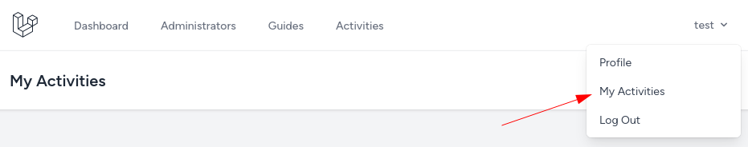
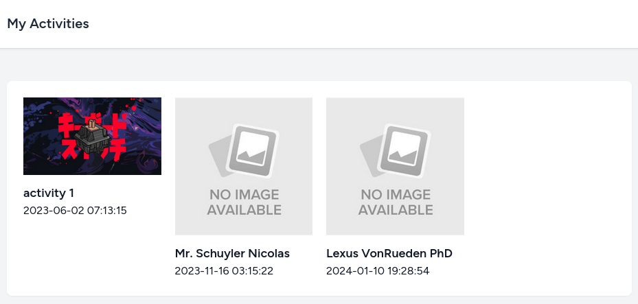
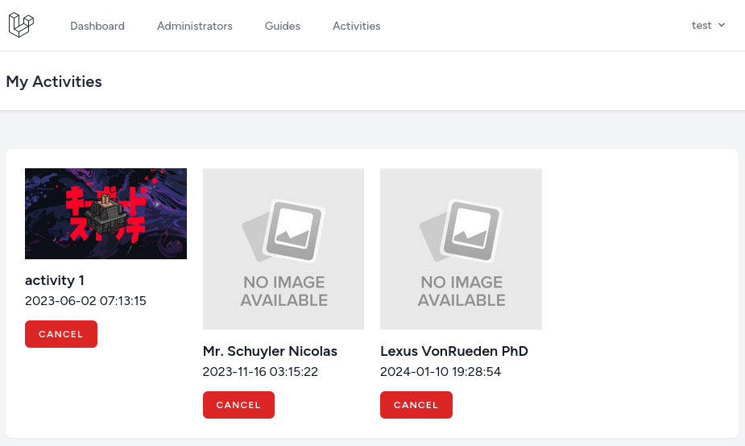
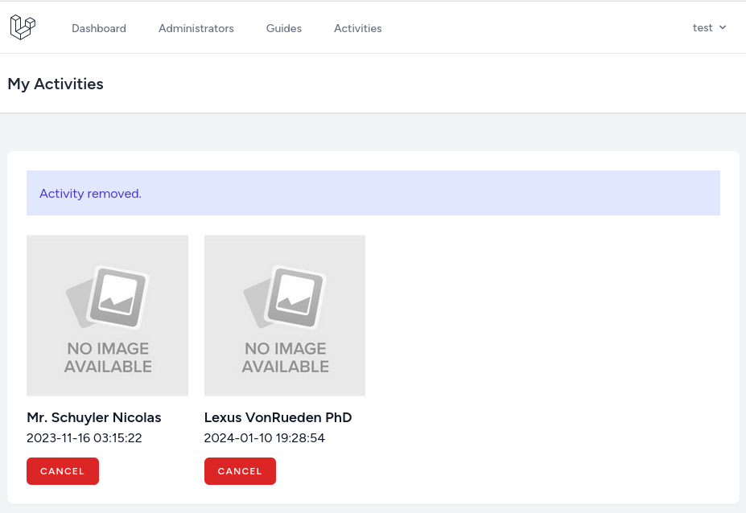
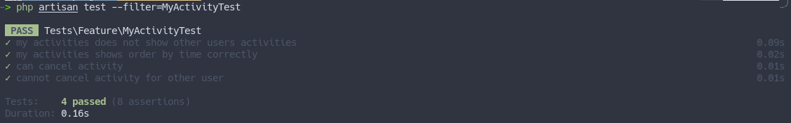

We have made that users can register for the activity and get redirected to the `my activities` page. Now let's show activities on the `my activities` page and add a button to cancel them.

---

## My Activities

We already have the Controller and Blade file for the `My activities` page. But we need a link in the navigation to access it. So first, let's add that link for the authenticated user under the `Profile` navigation item.

**resources/views/layouts/navigation.blade.php**:
```blade
// ...
<x-dropdown-link :href="route('profile.edit')">
    {{ __('Profile') }}
</x-dropdown-link>
<x-dropdown-link :href="route('my-activity.show')"> {{-- [tl! add:start] --}}
    {{ __('My Activities') }}
</x-dropdown-link> {{-- [tl! add:end] --}}
// ...
```

This is how it looks in the dropdown:



Now let's show the data! First, we need to get it in the Controller and order by the `start_time`.

**app/Http/Controllers/MyActivityController.php**:
```php
use App\Models\Activity;

class MyActivityController extends Controller
{
    public function show()
    {
        $activities = auth()->user()->activities()->orderBy('start_time')->get();

        return view('activities.my-activities', compact('activities'));
    }
}
```

And in the Blade, show it in the grid layout.

**resources/views/activities/my-activities.blade.php**:
```blade
// ...
<div class="p-6 text-gray-900">
    @if(session('success'))
        <div class="mb-6 bg-indigo-100 p-4 text-indigo-700">{{ session('success') }}</div>
    @endif

    My Activities {{-- [tl! --] --}}
    <div class="grid grid-cols-4 gap-5"> {{-- [tl! add:start] --}}
        @forelse($activities as $activity)
            <div class="space-y-3">
                <a href="{{ route('activity.show', $activity) }}">
                    thumbnail) }}" alt="{{ $activity->name }}"> </a>
                <h2>
                    <a href="{{ route('activity.show', $activity) }}" class="text-lg font-semibold">{{ $activity->name }}</a>
                </h2>
                <time>{{ $activity->start_time }}</time>
            </div>
        @empty
            <p>No activities</p>
        @endforelse
    </div> {{-- [tl! add:end] --}}
</div>
// ...
</x-app-layout>
```

The user will see a similar list in the image below:



---

## Cancel Activity

To cancel the activity, it's straightforward. We need to detach activity from the users' activities relationship. First, we will add a new route and a button to cancel activity below the start time.

**routes/web.php**:
```php
// ...

Route::middleware('auth')->group(function () {
    Route::get('/activities', [MyActivityController::class, 'show'])->name('my-activity.show');
    Route::delete('/activities/{activity}', [MyActivityController::class, 'destroy'])->name('my-activity.destroy'); // [tl! ++]

    // ...
});
```

**resources/views/activities/my-activities.blade.php**:
```blade
// ...
<div class="grid grid-cols-4 gap-5">
    @forelse($activities as $activity)
        <div class="space-y-3">
            <a href="{{ route('activity.show', $activity) }}">
                thumbnail) }}" alt="{{ $activity->name }}"> </a>
            <h2>
                <a href="{{ route('activity.show', $activity) }}" class="text-lg font-semibold">{{ $activity->name }}</a>
            </h2>
            <time>{{ $activity->start_time }}</time>
            <form action="{{ route('my-activity.destroy', $activity) }}" method="POST" onsubmit="return confirm('Are you sure?')"> {{-- [tl! add:start] --}}
                @csrf
                @method('DELETE')
                <x-danger-button>
                    Cancel
                </x-danger-button>
            </form> {{-- [tl! add:end] --}}
        </div>
    @empty
        <p>No activities</p>
    @endforelse
</div>
// ...
```

Now after every activity, we see a cancel button.



All that is left is to implement the logic. Before detaching and redirecting back, we need to check that activity belongs to a user and, if not, abort the action.

**app/Http/Controllers/MyActivityController.php**:
```php
use Symfony\Component\HttpFoundation\Response;

class MyActivityController extends Controller
{
    // ...

    public function destroy(Activity $activity)
    {
        abort_if(! auth()->user()->activities->contains($activity), Response::HTTP_FORBIDDEN);

        auth()->user()->activities()->detach($activity);

        return to_route('my-activity.show')->with('success', 'Activity removed.');
    }
}
```



---

## Tests

And let's add the tests for the `My activity` page. Here we will test:
- User sees only his activities.
- The user can cancel his activities and cannot cancel for other users.

```sh
php aritsan make:test MyActivityTest
```

**tests/Feature/MyActivityTest.php**:
```php
use Tests\TestCase;
use App\Models\User;
use App\Models\Activity;
use Illuminate\Foundation\Testing\RefreshDatabase;

class MyActivityTest extends TestCase
{
    use RefreshDatabase;

    public function test_my_activities_does_not_show_other_users_activities()
    {
        $user = User::factory()->create();
        $activity = Activity::factory()->create();
        $user->activities()->attach($activity);

        $user2 = User::factory()->create();
        $activity2 = Activity::factory()->create();
        $user2->activities()->attach($activity2);

        $response = $this->actingAs($user)->get(route('my-activity.show'));

        $response->assertSeeText($activity->name);
        $response->assertDontSeeText($activity2->name);
    }

    public function test_my_activities_shows_order_by_time_correctly()
    {
        $user = User::factory()->create();
        $activity = Activity::factory()->create(['start_time' => now()->addWeek()]);
        $activity2 = Activity::factory()->create(['start_time' => now()->addMonth()]);
        $activity3 = Activity::factory()->create(['start_time' => now()->addMonths(2)]);

        $response = $this->actingAs($user)->get(route('home'));

        $response->assertSeeTextInOrder([
            $activity->name,
            $activity2->name,
            $activity3->name,
        ]);
    }

    public function test_can_cancel_activity()
    {
        $user = User::factory()->create();
        $activity = Activity::factory()->create();
        $user->activities()->attach($activity);

        $response = $this->actingAs($user)->delete(route('my-activity.destroy', $activity));

        $response->assertRedirect(route('my-activity.show'));

        $this->assertCount(0, $user->activities()->get());
    }

    public function test_cannot_cancel_activity_for_other_user()
    {
        $user = User::factory()->create();
        $activity = Activity::factory()->create();
        $user->activities()->attach($activity);

        $user2 = User::factory()->create();

        $response = $this->actingAs($user2)->delete(route('my-activity.destroy', $activity));

        $response->assertForbidden();

        $this->assertCount(1, $user->activities()->get());
    }
}
```


