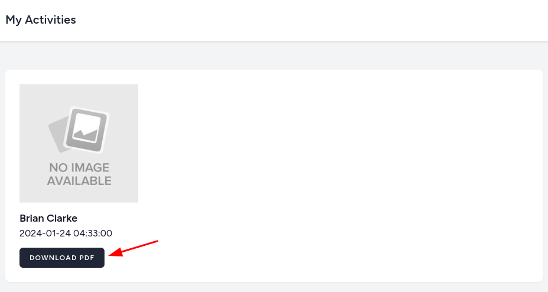

In the last lesson, we will allow users with the guide role to export activities into a PDF file. The PDF will show the activity name, start time, and a list of participants in a table.


---

## Exporting to PDF

We will use the package [barryvdh/laravel-dompdf](https://github.com/barryvdh/laravel-dompdf) for exporting PDF. It's a Laravel wrapper for the DOMPDF package.

```sh
composer require barryvdh/laravel-dompdf
```

Next, we need a Route and a button below the activity.

**routes/web.php**:
```php
// ...

Route::middleware('auth')->group(function () {
    Route::get('/activities', [MyActivityController::class, 'show'])->name('my-activity.show');
    Route::get('/guides/activities', [GuideActivityController::class, 'show'])->name('guide-activity.show');
    Route::get('/guides/activities/{activity}/pdf', [GuideActivityController::class, 'export'])->name('guide-activity.export'); // [tl! ++]
    Route::delete('/activities/{activity}', [MyActivityController::class, 'destroy'])->name('my-activity.destroy');

   // ...
});
```

**resources/views/activities/guide-activities.blade.php**:
```blade
// ...
<div class="space-y-3">
    <a href="{{ route('activity.show', $activity) }}">
        thumbnail) }}" alt="{{ $activity->name }}"> </a>
    <h2>
        <a href="{{ route('activity.show', $activity) }}" class="text-lg font-semibold">{{ $activity->name }}</a>
    </h2>
    <time>{{ $activity->start_time }}</time>
    <a href="{{ route('guide-activity.export', $activity) }}" class="inline-flex items-center px-4 py-2 bg-gray-800 border border-transparent rounded-md font-semibold text-xs text-white uppercase tracking-widest hover:bg-gray-700 focus:bg-gray-700 active:bg-gray-900 focus:outline-none focus:ring-2 focus:ring-indigo-500 focus:ring-offset-2 transition ease-in-out duration-150"> {{-- [tl! add:start] --}}
        Download PDF
    </a> {{-- [tl! add:end] --}}
</div>
// ...
```



Now we can use the package to download the PDF.

**app/Http/Controllers/GuideActivityController.php**:
```php
use Barryvdh\DomPDF\Facade\Pdf;

class GuideActivityController extends Controller
{
    // ...

    public function export(Activity $activity)
    {
        abort_if(auth()->user()->role_id !== Role::GUIDE->value, Response::HTTP_FORBIDDEN);

        $data = $activity->load(['participants' => function($query) {
            $query->orderByPivot('created_at');
        }]);

        return Pdf::loadView('activities.pdf', ['data' => $data])->download("{$activity->name}.pdf");
    }
}
```

We are using Blade for outputting data.

**resouces/views/activities/pdf.blade.php**:
```blade
<h1>{{ $data->name }}</h1>

<h4>Start time {{ $data->start_time }}</h4>

<table>
    <thead>
        <tr>
            <th></th>
            <th>Name</th>
            <th>Email</th>
            <th>Registration Time</th>
        </tr>
    </thead>
    <tbody>
        @foreach($data->participants as $participant)
            <tr>
                <td>{{ $loop->iteration }}</td>
                <td>{{ $participant->name }}</td>
                <td>{{ $participant->email }}</td>
                <td>{{ $participant->pivot->created_at }}</td>
            </tr>
        @endforeach
    </tbody>
</table>
```


> Of course, you might need to add some styles to the PDF file for better readability.

---

## Tests

There isn't much that we can test with the PDF. We will add one test to the `GuideActivityTest` to check if PDF isn't empty, the content type is `application/pdf`, and the filename is correct.

**tests/Feature/GuideActivityTest.php**:
```php
class GuideActivityTest extends TestCase
{
    // ...

    public function test_pdf_export()
    {
        $guide = User::factory()->guide()->create();
        $activity = Activity::factory()->create(['guide_id' => $guide->id]);

        $response = $this->actingAs($guide)->get(route('guide-activity.export', $activity));

        $this->assertNotEmpty($response->getContent());
        $this->assertEquals('application/pdf', $response->headers->get('Content-Type'));
        $this->assertEquals('attachment; filename="' . $activity->name .'.pdf"', $response->headers->get('Content-Disposition'));
    }
}
```
